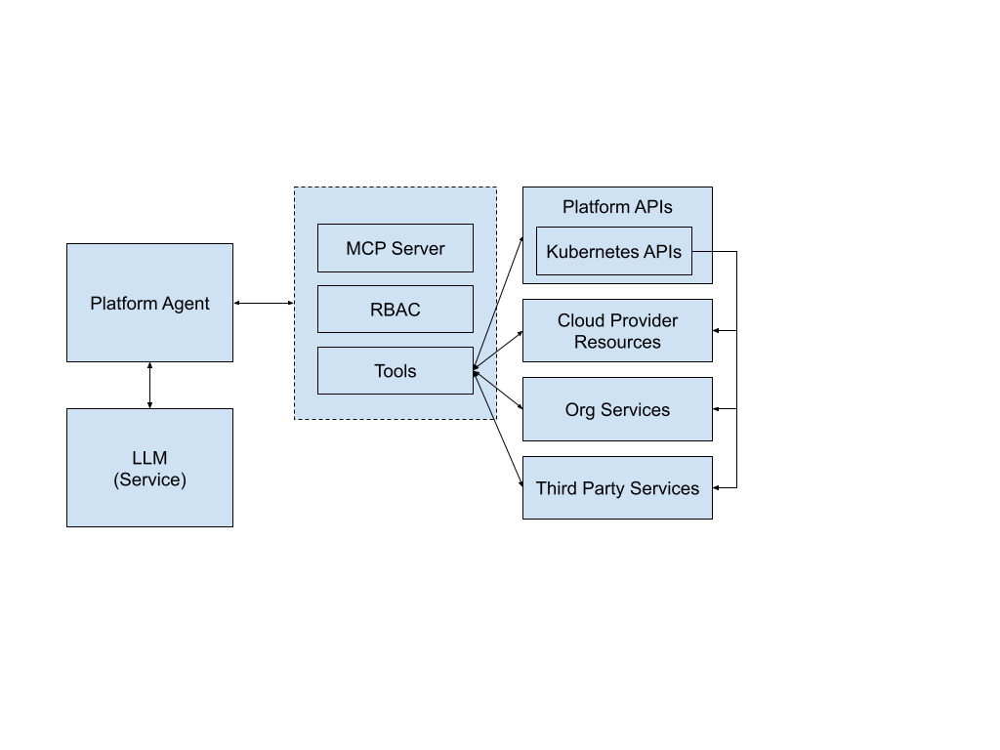
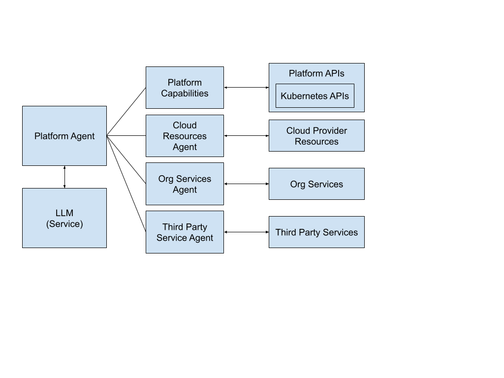
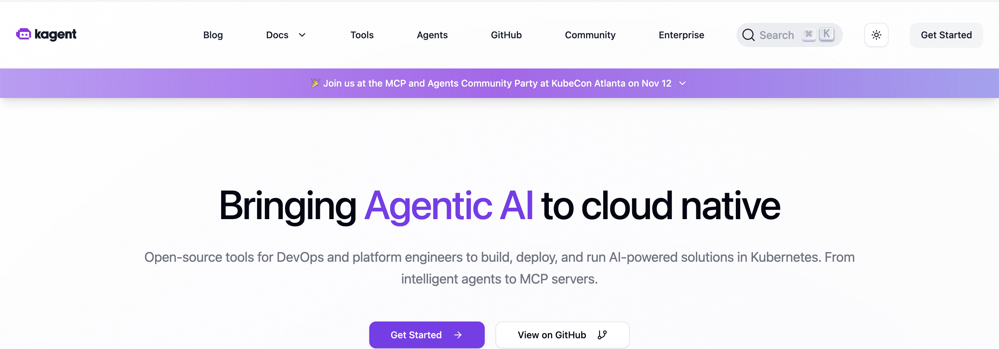

<!-- .slide: data-background="img/idp-problem-capabilities.jpeg" data-background-size="contain" data-background-color="black" -->

Note:
AI has no idea which services are actually available in my environment. Sure, it mentioned RDS and EC2, but what if I'm running everything on Kubernetes? What if I have custom operators or Crossplane providers already deployed?

## Tools and Agents

## But do you want to build all this stuff?

- Each service integration will require to use the MCP protocol
- If your agent needs to know about all the capabilities/integrations, your agent will be very complex
- Why not using existing agents?

## More Specialized Agents

## Kagent

