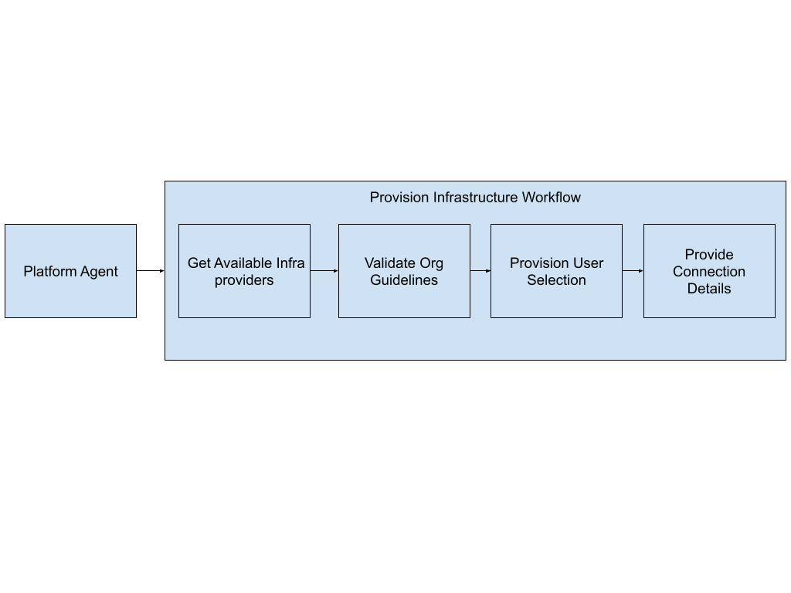
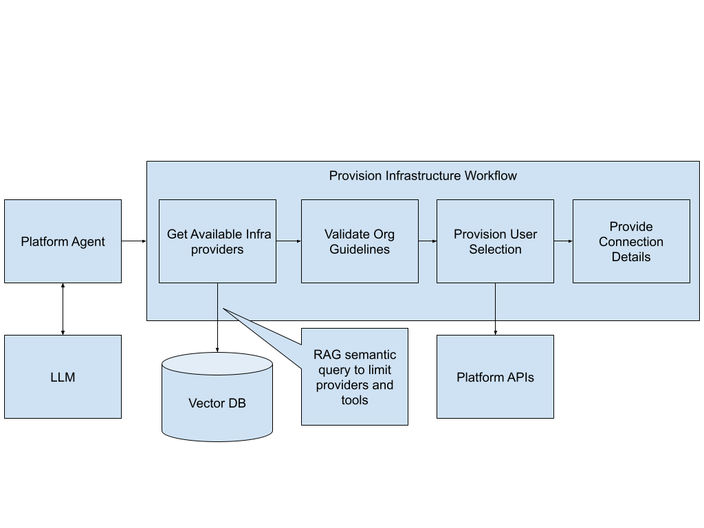
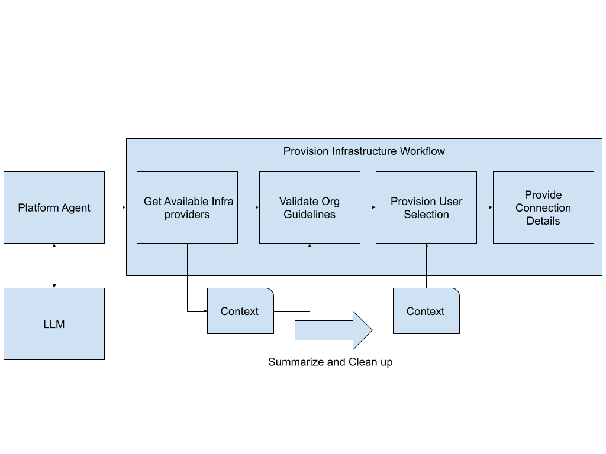
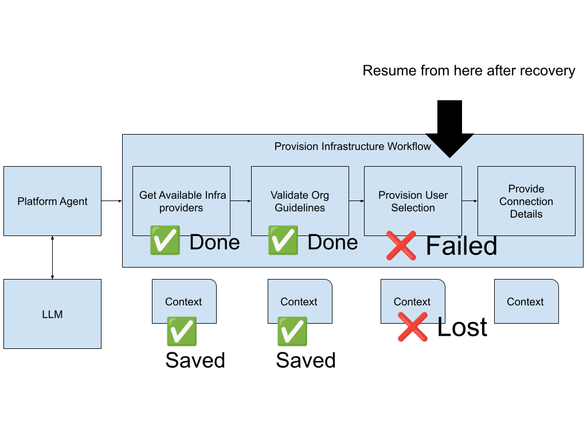
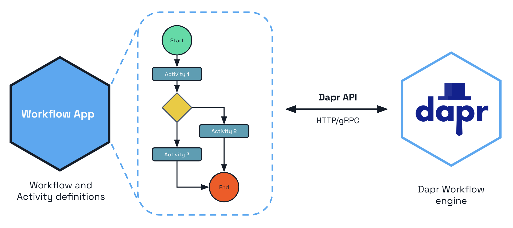
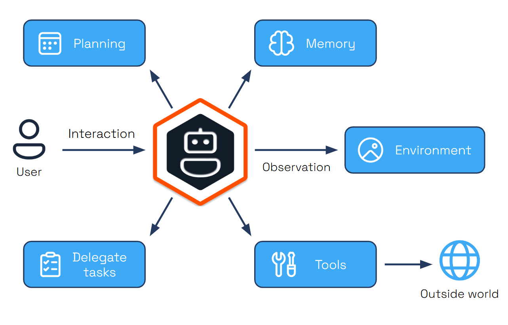

<!-- .slide: data-background="img/idp-problem-intent.jpeg" data-background-size="contain" data-background-color="black" -->

Note:
Finally, we have the problem of insifficient intent. If we don't describe what we need, no one can make our wishes come true. That's where workflows come into play.

<!-- .slide: data-background="img/idp-solution-workflows.jpeg" data-background-size="contain" data-background-color="black" -->

Note:
Now let's talk about workflows. What exactly are workflows in the context of AI-powered infrastructure management?

Workflows are structured, semi-predictable sequences of steps designed to accomplish something complex. They break down big tasks into manageable pieces, guide users through decision points, and ensure all necessary information is gathered before taking action.

In our example, a workflow is a combination of fetching information from various sources and analyzing that information with AI. Each step in the workflow can involve data gathering, AI analysis, or both. We might fetch information from users to enhance their intent, pull relevant patterns and policies from the Vector database, get current schemas from Kubernetes clusters, gather operational data, and source information from anywhere else that's relevant. Then AI analyzes all this collected data to make intelligent decisions about the next step.

## Workflow in practice

### Reducing scope to perform a specific action

### Summarizing Context to clean up garbage

### Resilliency and durable executions to save costs

### Dapr Workflows (workflows-as-code) 

### Dapr Agents (Python)

