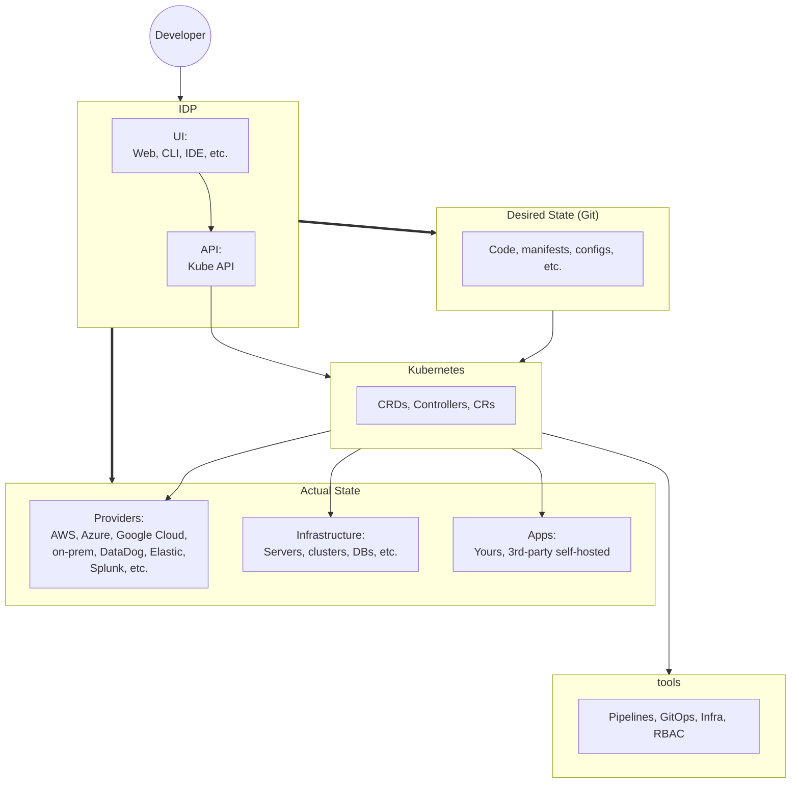
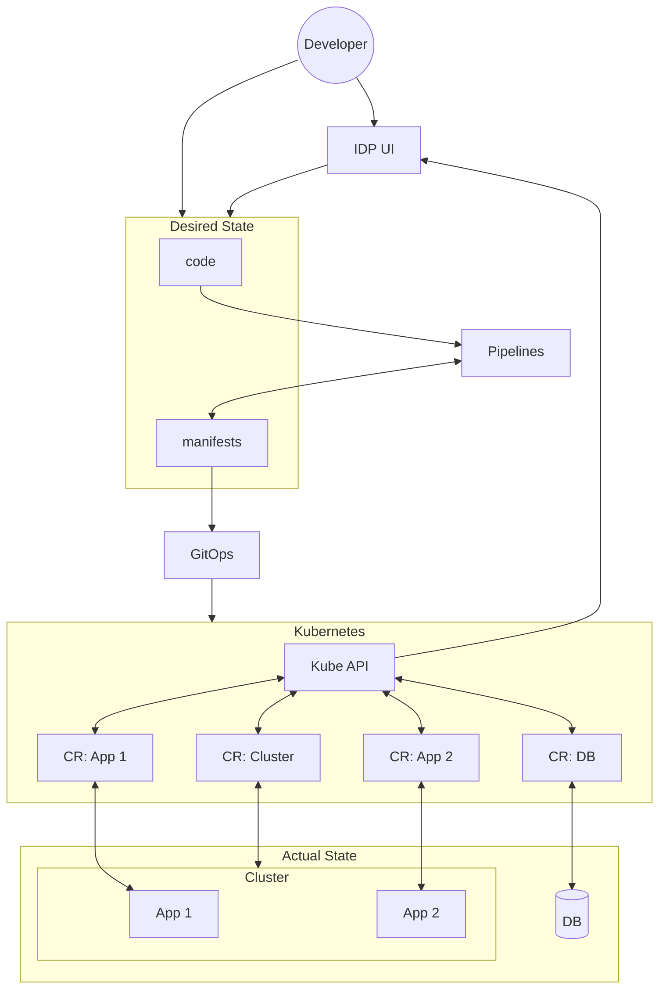

```mermaid
flowchart TB
    developer((Developer))

    subgraph k8s[Kubernetes]
        Resources[CRDs, Controllers, CRs]
    end

    subgraph idp[IDP]
        idpUI[UI:\nWeb, CLI, IDE, etc.]
        idpApi[API:\nKube API]

        idpUI --> idpApi
    end

    subgraph desiredState["Desired State (Git)"]
        Git[Code, manifests, configs, etc.]
    end

    subgraph actualState[Actual State]
        actualStateProviders[Providers:\nAWS, Azure, Google Cloud,\non-prem, DataDog, Elastic,\nSplunk, etc.]
        actualStateInfrastructure[Infrastructure:\nServers, clusters, DBs, etc.]
        actualStateApps[Apps:\nYours, 3rd-party self-hosted]
    end
    
    subgraph tools
        toolTypes[Pipelines, GitOps, Infra, RBAC]
    end

    developer --> idp

    idp ==> actualState
    idp ==> desiredState
    idpApi --> k8s

    desiredState --> k8s

    k8s --> actualStateProviders
    k8s --> actualStateInfrastructure
    k8s --> actualStateApps
    k8s ----> tools
```

```mermaid
flowchart TB
    developer((Developer))

    subgraph desiredState[Desired State]
        code
        manifests
    end

    pipelines[Pipelines]

    gitOps[GitOps]

    ui[IDP UI]

    subgraph k8s[Kubernetes]
        kubeApi[Kube API]
        crCluster[CR: Cluster]
        crApp1[CR: App 1]
        crApp2[CR: App 2]
        crDB[CR: DB]

        kubeApi <--> crCluster
        kubeApi <--> crApp1
        kubeApi <--> crApp2
        kubeApi <--> crDB
    end

    subgraph actualState[Actual State]
        subgraph cluster[Cluster]
            app1[App 1]
            app2[App 2]
        end
        db[(DB)]
    end

    kubeApi --> ui

    developer --> desiredState
    developer --> ui

    code --> pipelines
    pipelines <--> manifests
    manifests --> gitOps

    ui --> desiredState

    gitOps --> k8s

    crCluster <--> cluster
    crApp1 <--> app1
    crApp2 <--> app2
    crDB <--> db
```
