# DevOps Categories

* Application Management
* Infrastructure & Services
* GitOps
* Progressive Delivery
* Security
* Development

# DevOps Categories

* CI/CD Pipelines
* Logging, Monitoring, And Troubleshooting
* Kubernetes Dashboards
* Containers
* Kubernetes

# Self-Managed Apps

<figure>
    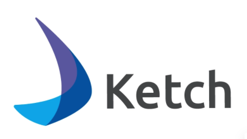
    
    
</figure>
<figure>
    
    
</figure>

# Self-Managed Apps

<figure>
    
    
</figure>

# Managed Apps

<figure>
    
    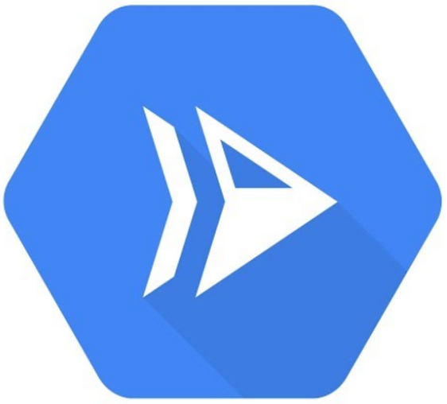
    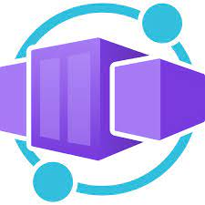
</figure>
<figure>
    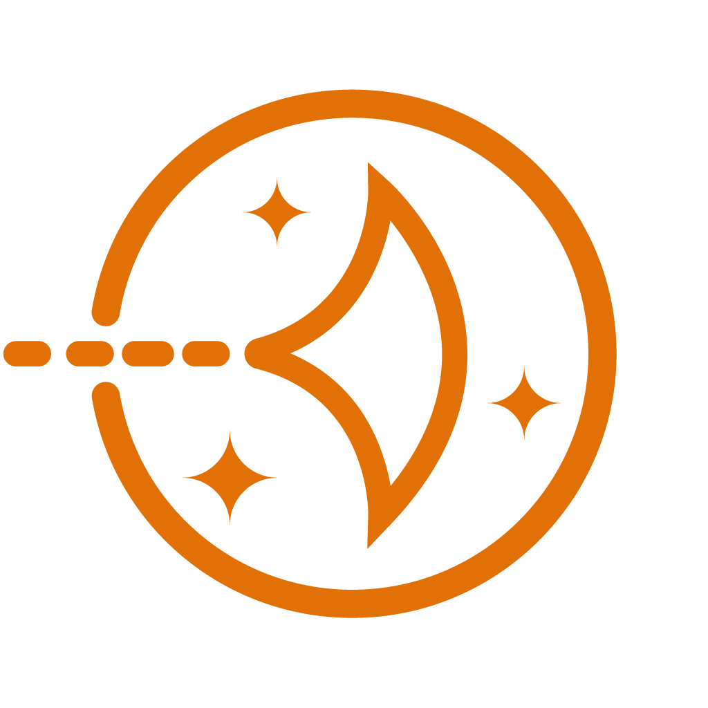
    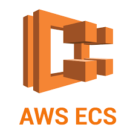
    
</figure>

# Managed Apps

# Infra & Services

<figure>
    
    
    
</figure>
<figure>
    
    
</figure>

# Infra & Services

# GitOps

<figure>
    
    
    
</figure>

# GitOps

# Progressive Delivery

<figure>
    
    
</figure>

# Progressive Delivery

# Security

<figure>
    
    
    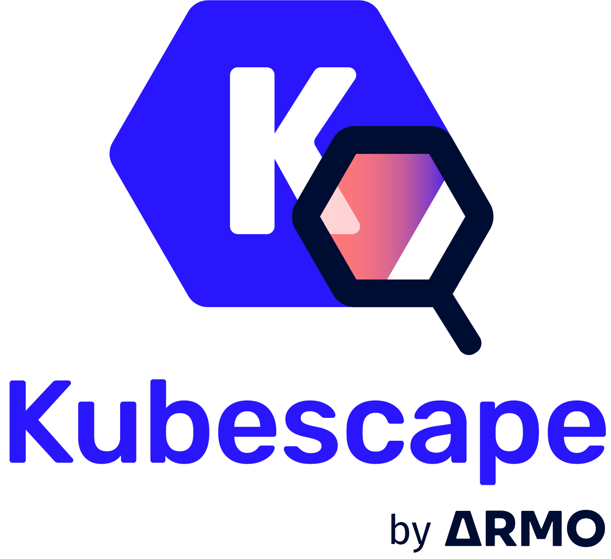
</figure>
<figure>
    
</figure>

# Security

# Dev Environment

<figure>
    
    
    
</figure>
<figure>
    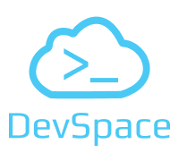
    
</figure>

# Dev Environment

# Dev k8s Cluster

<figure>
    
    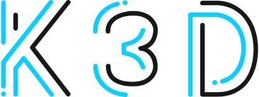
    
</figure>
<figure>
    
    
    
</figure>

# Dev k8s Cluster

<figure>
    
    
</figure>

# CI/CD Pipelines

<figure>
    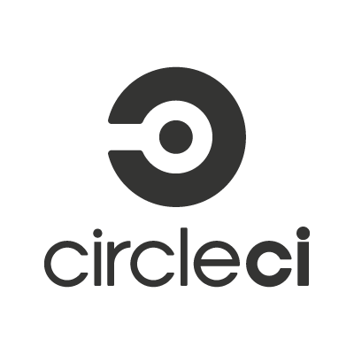
    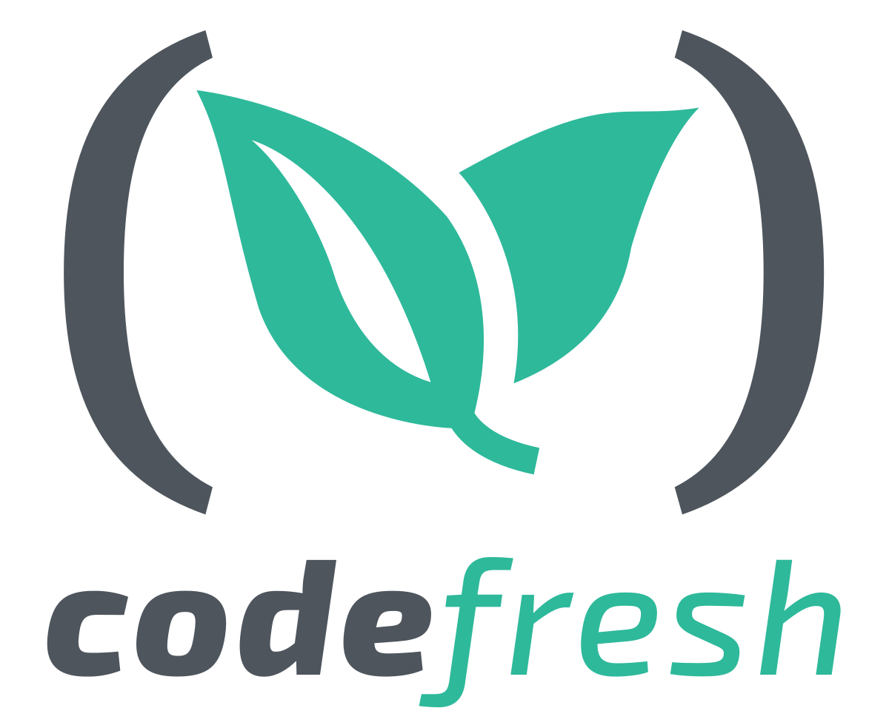
    
</figure>
<figure>
    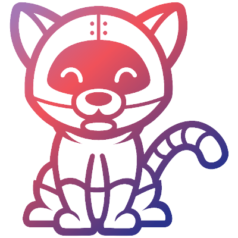
    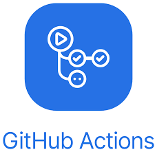
    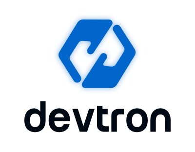
</figure>

# CI/CD Pipelines

<figure>
    
    
</figure>

# Logging

<figure>
    
</figure>

# Monitoring

<figure>
    
</figure>

# Visualization

<figure>
    
</figure>

# Troubleshooting

<figure>
    
    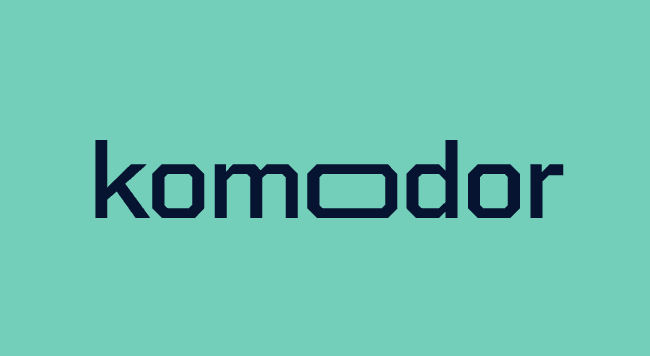
</figure>

# Troubleshooting

<figure>
    
</figure>

# Kubernetes Dashboards

<figure>
    
    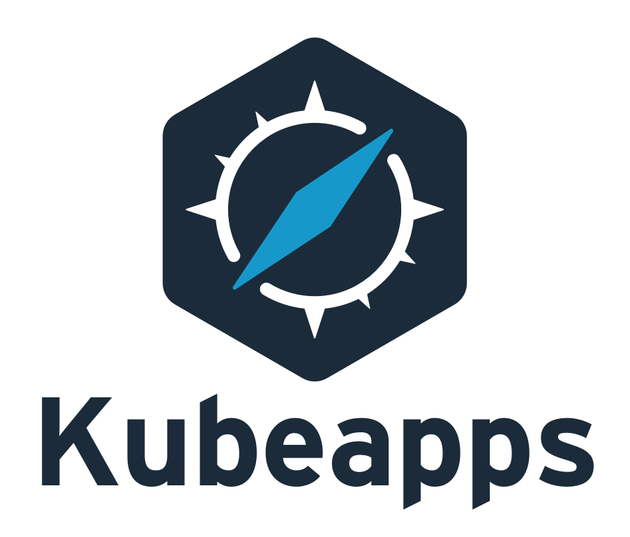
    
    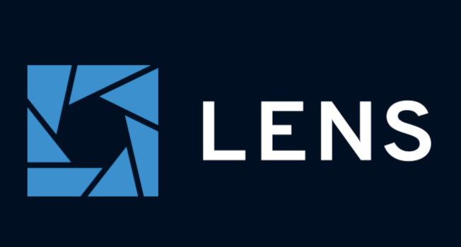
    
    
</figure>

# Kubernetes Dashboards

<figure>
    
    
</figure>

# Containers

<figure>
    
    
    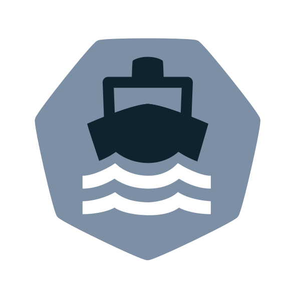
    
</figure>

# Containers

<figure>
    
    
    
</figure>

# Kubernetes

<figure>
    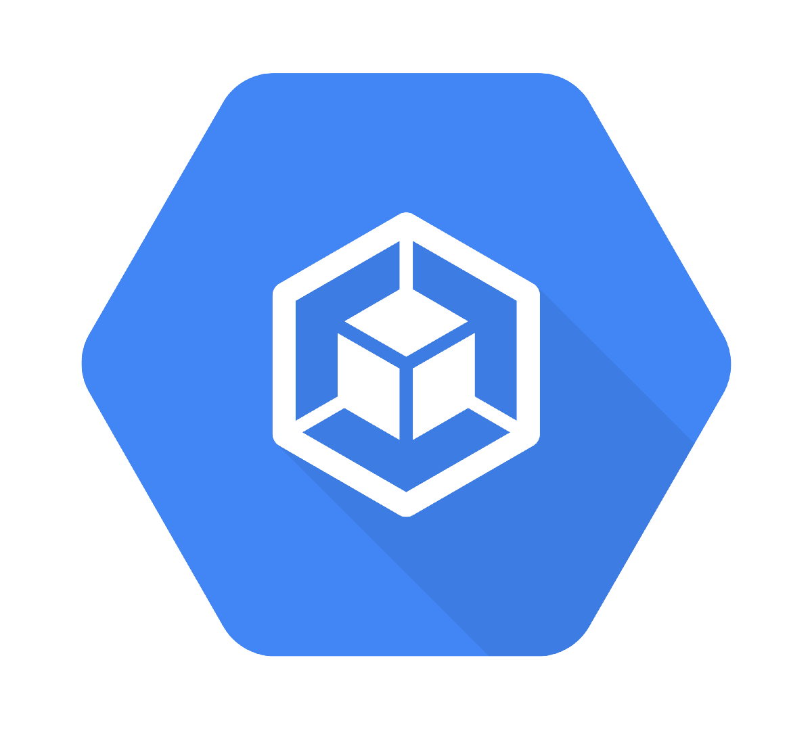
    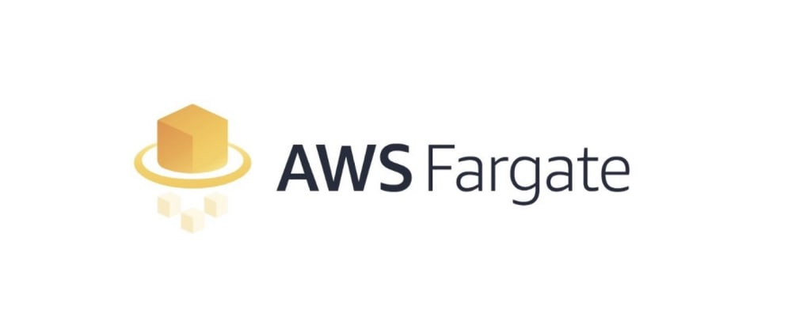
    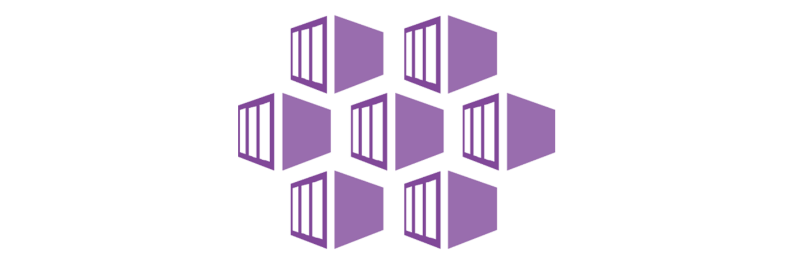
    
    
    
    
</figure>

# Kubernetes

<figure>
    
    
</figure>
