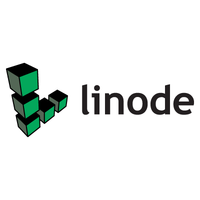

# A long time ago...

## ... baremetal servers in our own datacenters

# Then ...

## ... progressed towards VMs
## ... we got services, APIs, and control planes
## ... and moved into Clouds

# Today...

## ... we're raising above clouds

# Baremetal On-Prem

## Static infrastructure
## Patience is a virtue
## No services, no APIs, no control planes
## Mostly SSH
## One server at a time

# VMs

## Create servers on a whim
## Still (mostly) mutable
## Easier for ops...
## ...the same for everyone else

# Moving To Cloud

# Cloud Before

## APIs, control planes
## VMs and storage as services
## Dynamic

# Cloud Before

## We had hardware

# Cloud Before

## Now we got (better)...
## ... Services
## ... APIs
## ... Control planes

# Cloud Before

## Could we do it outselves?
## Was it worth it doing it ourselves?

# Cloud Today

## Services for everything
## Services behind APIs
## Managed by control planes

# Multi-Cloud

# (Almost) Everyone ...

## ... Is Multi-Cloud

# Really?

# Using Any Of Those?

# (Almost) Everyone Is Multi-Cloud

## Likely not using all of those

# (Almost) Everyone Is Multi-Cloud

## But (almost) surely using more than one

# (Almost) Everyone Is Multi-Cloud

## You are multi-cloud!

# How Does Cloud Work?

## UI/CLI > API > Control Plane > Something

# Problems?

## Fragmentation
## Too many UIs, CLIs, and APIs
## Hard to manage
## Hard to coordinate
## Hard to observe
## Mostly building blocks

# The Solution?

## Universal API
## Universal control plane
## Raise above clouds

# The Solution?

## Tailor-made services
## Tailor-made platforms
## Shift-Left
