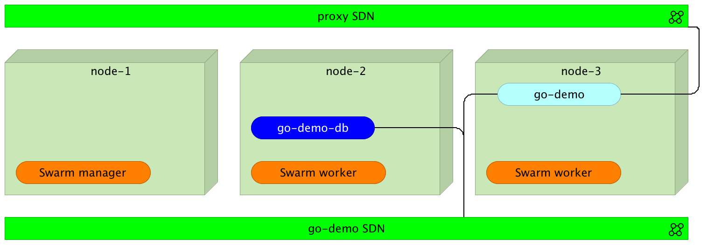
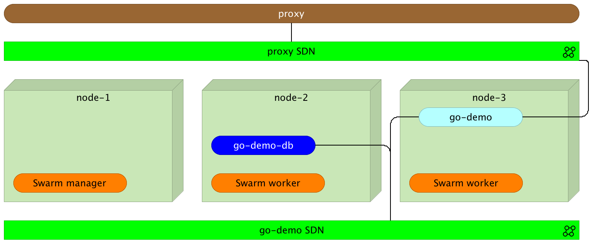
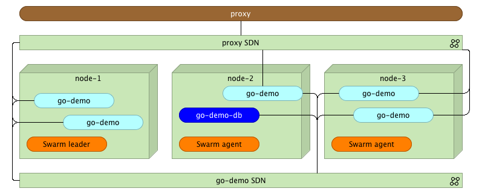

Integrating Proxy With Docker Swarm (Tour Around Docker 1.12 Series)
====================================================================

> This article continues where [Docker Swarm Introduction](https://technologyconversations.com/2016/07/29/docker-swarm-introduction-tour-around-docker-1-12-series/) left. I will assume that you have at least a basic knowledge how Swarm in Docker v1.12+ works. If you don't, please read the previous article first.

The fact that we can deploy any number of services inside a Swarm cluster does not mean that they are accessible to our users. We already saw that the new Swarm networking made it easy for services to communicate with each other.

Let's explore how we can utilize it to expose them to the public. We'll try to integrate a proxy with the Swarm network and further explore benefits version v1.12 brought.

Before we proceed, we need to setup a cluster we'll use for the examples.

Environment Setup
-----------------

The examples that follow assume that you have [Docker Machine](https://www.docker.com/products/docker-machine) version v0.8+ that includes [Docker Engine](https://www.docker.com/products/docker-engine) v1.12+. The easiest way to get them is through [Docker Toolbox](https://www.docker.com/products/docker-toolbox).

> If you are a Windows user, please run all the examples from *Git Bash* (installed through *Docker Toolbox*).

I won't go into details of the environment setup. It is the same as explained in the [Docker Swarm Introduction](https://technologyconversations.com/2016/07/29/docker-swarm-introduction-tour-around-docker-1-12-series/) article. We'll set up three nodes that will form a Swarm cluster.

```
docker-machine create -d virtualbox node-1

docker-machine create -d virtualbox node-2

docker-machine create -d virtualbox node-3

eval $(docker-machine env node-1)

docker swarm init \
    --advertise-addr $(docker-machine ip node-1) \
    --listen-addr $(docker-machine ip node-1):2377

TOKEN=$(docker swarm join-token -q worker)

eval $(docker-machine env node-2)

docker swarm join --token $TOKEN $(docker-machine ip node-1):2377

eval $(docker-machine env node-3)

docker swarm join --token $TOKEN $(docker-machine ip node-1):2377
```

Now that we have the Swarm cluster, we can deploy a service.


Deploying Services To The Cluster
---------------------------------

To experiment the new Docker Swarm networking, we'll start by creating two networks.

```bash
eval $(docker-machine env node-1)

docker network create --driver overlay proxy

docker network create --driver overlay go-demo
```

The first one (*proxy*) will be used for the communication between the proxy and the services that expose public facing APIs. We'll use the second (*go-demo*) for all containers that form the *go-demo* service. It consists of two containers. It uses MongoDB to store data and *vfarcic/go-demo* as the back-end with an API.

We'll start with the database. Since it is not public-facing, there is no need to add it to the proxy. Therefore, we'll attach it only to the *go-demo* network.

```bash
docker service create --name go-demo-db \
  --network go-demo \
  mongo
```

With the database up and running, we can deploy the back-end. Since we want our external users to be able to use the API, we should integrate it with the proxy. Therefore, we should attach it to both networks (*proxy* and *go-demo*).

```bash
docker service create --name go-demo \
  -e DB=go-demo-db \
  --network go-demo \
  --network proxy \
  vfarcic/go-demo
```



Now both containers are running somewhere inside the cluster and are able to communicate with each other through the *go-demo* network. Let's bring the proxy into the mix. We'll use [HAProxy](http://www.haproxy.org/). The principles we'll explore are the same no matter which one will be your choice.

Please note that we did not specify ports. That means the neither containers are accessible from outside the *go-demo* network.

Setting Up a Proxy Service
--------------------------

We can implement the proxy in a couple of ways. One would be to create a new image based on *[HAProxy](https://hub.docker.com/_/haproxy/)* and include configuration files inside it. That approach would be a good one if the number of different services is relatively static. Otherwise, we'd need to create a new image with a new configuration every time there is a new service (not a new release).

The second approach would be to expose a volume. That way, when needed, we could modify the configuration file instead building a whole new image. However, that has downsides as well. When deploying to a cluster, we should avoid using volumes whenever that's not necessary. As you'll see soon, a proxy is one of those that do not require a volume. As a side note, `--volume` has been replaced with the `docker service` argument `--mount`.

The third option is to use one of the proxies designed to work with Docker Swarm. In this case, we'll use *[vfarcic/docker-flow-proxy](https://hub.docker.com/r/vfarcic/docker-flow-proxy/)* container, created from the *[Docker Flow: Proxy](https://github.com/vfarcic/docker-flow-proxy)* project. It is based on HAProxy with additional features that allow us to reconfigure it by sending HTTP requests.

Let's give it a spin.

```bash
docker service create --name proxy \
    -p 80:80 \
    -p 443:443 \
    -p 8080:8080 \
    --network proxy \
    -e MODE=swarm \
    vfarcic/docker-flow-proxy
```

We opened ports *80* and *443* that will serve Internet traffic (*HTTP* and *HTTPS*). The third port is *8080*. We'll use it to send configuration requests to the proxy. Further on, we specified that it should belong to the *proxy* network. That way, since *go-demo* is also attached to the same network, the proxy can access it through the SDN.

Through the proxy we just run we can observe one of the cool features of the network routing mesh. It does not matter on which server the proxy is running. We can send a request to any of the nodes and Docker network will make sure that it is redirected to one of the proxies.

The last argument is the environment variable *MODE* that tells the proxy that containers will be deployed to a Swarm cluster. Please consult the project [README](https://github.com/vfarcic/docker-flow-proxy) for other combinations.



> Please note that the proxy, even though it is running inside one of the nodes, is placed outside to better illustrate the logical separation.

Before we move on, let's confirm that the proxy is running.

```bash
docker service ps proxy
```

We can proceed if the *Last state* is *Running*. Otherwise, please wait until the service is up and running.

Now that the proxy is deployed, we should let it know about the existence of the *go-demo* service.

```bash
curl "$(docker-machine ip node-1):8080/v1/docker-flow-proxy/reconfigure?serviceName=go-demo&servicePath=/demo&port=8080"
```

The request was sent to *reconfigure* the proxy specifying the service name (*go-demo*), URL path of the API (*/demo*), and the internal port of the service (*8080*). From now on, all the requests to the proxy with the path that starts with */demo* will be redirected to the *go-demo* service.

We can test that the proxy indeed works as expected by sending an HTTP request.

```bash
curl -i $(docker-machine ip node-1)/demo/hello
```

The output of the `curl` command is as follows.

```
HTTP/1.1 200 OK
Date: Mon, 18 Jul 2016 23:11:31 GMT
Content-Length: 14
Content-Type: text/plain; charset=utf-8

hello, world!
```

The proxy works! It responded with the HTTP status *200* and returned the API response *hello, world!*.

Please note that it does not matter to which node we send the request. Since Docker networking (routing mesh) takes care of load balancing, we can hit any of the servers. As an example, let's send the same request but, this time, to the *node-3*.

```bash
curl -i $(docker-machine ip node-3)/demo/hello
```

The result is still the same.

Let's explore the configuration generated by the proxy.

Proxy Configuration
-------------------

If you choose to roll-up your own proxy solution, it might be useful to understand how to configure the proxy and leverage new Docker networking features.

Let's start by examining the configuration *[Docker Flow: Proxy](https://github.com/vfarcic/docker-flow-proxy)* created for us. We can do that by entering the running container to take a sneak peek at the */cfg/haproxy.cfg* file. The problem is that finding a container run by Docker Swarm is a bit tricky. For example, if we deployed it with Docker Compose, the container name would be predictable. It would use <PROJECT>_<SERVICE>_<INDEX> format. The `docker service` command runs containers with hashed names. The *docker-flow-proxy* created on my laptop has the name *proxy.1.e07jvhdb9e6s76mr9ol41u4sn*. Therefore, to get inside a running container deployed with Docker Swarm, we need to use a filter with, for example, image name.

First, we need to find out on which node the proxy is running.

```bash
docker service ps proxy
```

Please note the value of the *node* column and make sure that it is used in the command that follows.

```bash
eval $(docker-machine env node-1) # Change node-1 with the node value previously obtained
```

The command that will output configuration of the proxy is as follows.

```bash
docker exec -it \
    $(docker ps -q --filter "ancestor=vfarcic/docker-flow-proxy") \
    cat /cfg/haproxy.cfg
```

The important part of the configuration is as follows.

```
frontend services
    bind *:80
    bind *:443
    option http-server-close

    acl url_go-demo path_beg /demo
    use_backend go-demo-be if url_go-demo

backend go-demo-be
    server go-demo go-demo:8080
```

The first part (`frontend`) should be familiar to those who used HAProxy. It accepts requests on ports `80` (*HTTP*) and `443` (*HTTPS*). If the path starts with `/demo`, it will be redirected to the `backend go-demo-be`. Inside it, requests are sent to the address `go-demo` on the port `8080`. The address is the same as the name of the service we deployed. Since `go-demo` belongs to the same network as the proxy, Docker will make sure that the request is redirected to the destination container. Neat, isn't it? There is no need, anymore, to specify IPs and external ports.

The next question is how to do load balancing. How should we specify that the proxy should, for example, perform round-robin across all instances?

Load Balancing
--------------

Before we start load balancing explanation, let's create a few more instances of the *go-demo* service.

```bash
eval $(docker-machine env node-1)

docker service scale go-demo=5
```

Within a few moments, five instances of the *go-demo* service will be running.



What should we do to make the proxy balance requests across all instances? The answer is nothing. No action is necessary on our part.

Normally, if we wouldn't leverage Docker Swarm features, we would have something similar to the following configuration mock-up.

```
backend go-demo-be
    server instance_1 <INSTANCE_1_IP>:<INSTANCE_1_PORT>
    server instance_2 <INSTANCE_2_IP>:<INSTANCE_2_PORT>
    server instance_3 <INSTANCE_3_IP>:<INSTANCE_3_PORT>
    server instance_4 <INSTANCE_4_IP>:<INSTANCE_4_PORT>
    server instance_5 <INSTANCE_5_IP>:<INSTANCE_5_PORT>
```

However, with the new Docker networking inside a Swarm cluster, that is not necessary. It only introduces complications that require us to monitor instances and update the proxy every time a new replica is added or removed.

Docker will do load balancing for us. To be more precise, when the proxy redirects a request to `go-demo`, it is sent to Docker networking which, in turn, performs load balancing across all replicas (instances) of the service. The implication of this approach is that proxy is in charge of redirection from port *80* (or *443*) to the correct service inside the network, and Docker does the rest.

Feel free to make requests to the service and inspect logs of one of the replicas. You'll see that, approximately, one fifth of the requests is sent to it.

Final Words
-----------

Docker networking introduced with the new Swarm included in Docker 1.12+ opens a door for quite a few new opportunities. Internal communication between containers and load balancing are only a few. Configuring public facing proxies became easier than ever. We have to make sure that all services that expose a public facing API are plugged into the same network as the proxy. From there on, all we have to do is configure it to redirect all requests to the name of the destination service. That will result in requests traveling from the proxy to Docker network which, in turn, will perform load balancing across all instances.

The question that might arise is whether this approach is efficient. After all, we introduced a new layer. While in the past we'd have only a proxy and a service, now we have Docker networking with a load balancer in between. The answer is that overhead of such an approach is minimal. Docker uses [Linux IPVS](http://www.linuxvirtualserver.org/software/ipvs.html) for load balancing. It's been in the Linux kernel for more than fifteen years and proved to be one of the most efficient ways to load balance requests. Actually, it is much faster than *nginx* or *HAProxy*.

The next question is whether we need a proxy. We do. IPVS used by Docker will not do much more than load balancing. We still need a proxy that will accept requests on ports *80* and *443* and, depending on their paths, redirect them to one service or another. On top of that, we might use it to perform other tasks like SSL handshake, authentication, and so on.

What are the downsides? The first one that comes to my mind are sticky sessions. If you expect the same user to send requests to the same instance, this approach will not work. A separate question is whether we should implement sticky sessions inside our services or as a separate entity. I'll leave that discussion for one of the next articles. Just keep in mind that sticky sessions will not work with this type of load balancing.

How about advantages? You already saw that simplicity is one of them. There's no need to reconfigure your proxy every time a new replica is deployed. As a result, the whole process is greatly simplified. Since we don't need the list of all IPs and ports of all instances, there is no need for tools like [Registrator](https://github.com/gliderlabs/registrator) and [Consul Template](https://github.com/hashicorp/consul-template). In the past, one of the possible solutions was to use Registrator to monitor Docker events and store IPs and ports in a key-value store (e.g. [Consul](https://www.consul.io/)). Once information is stored, we would use Consul Template to recreate proxy configuration. There we many projects that simplified the process (one of them being the old version of the [Docker Flow: Proxy](https://github.com/vfarcic/docker-flow-proxy)). However, with Docker Swarm and networking, the process just got simpler.

To *Docker Flow: Proxy* Or Not To *Docker Flow: Proxy*
------------------------------------------------------

I showed you how to configure HAProxy using [Docker Flow: Proxy](https://github.com/vfarcic/docker-flow-proxy) project. It contains HAProxy with an additional API that allows it to reconfigure the proxy with a simple HTTP request. It removes the need for manual configuration or templates.

On the other hand, rolling up your own solution became easier than ever. With the few pointers from this article, you should have no problem creating *nginx* or *HAProxy* configuration yourself.

My suggestion is to give [Docker Flow: Proxy](https://github.com/vfarcic/docker-flow-proxy) a try before you make a decision. In either case, new Docker Swarm networking features are impressive and provide building blocks for more to come.

What Now?
---------

That concludes the exploration of some of the new Swarm and networking features we got with Docker v1.12. In particular, we explored those related to public facing proxies.

Is this everything there is to know to run a Swarm cluster successfully? Not even close! What we explored by now (in this and the previous article) is only the beginning. There are quite a few questions waiting to be answered. What happened to Docker Compose? How do we deploy new releases without downtime? Are there any additional tools we should use?

I'll try to give answers to those and quite a few other questions in future articles. The next one will be dedicated to *Distributed Application Bundles*.
