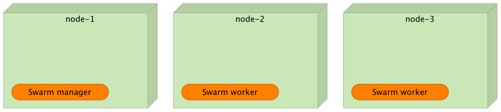

Zero-Downtime Deployments to Docker Swarm (Tour Around Docker 1.12 Series)
==========================================================================


If this is your first contact with the new Docker Swarm (version 1.12+), please read [Docker Swarm Introduction](https://technologyconversations.com/2016/07/29/docker-swarm-introduction-tour-around-docker-1-12-series/) and [Integrating Proxy With Docker Swarm](https://technologyconversations.com/2016/08/01/integrating-proxy-with-docker-swarm-tour-around-docker-1-12-series/) articles. I will assume that you have (at least) a basic understanding of how to deploy Docker services to a Swarm cluster.

Today we'll explore how to accomplish zero-downtime deployments.

The shorter the iterations we are practicing, the greater the frequency of our deployments. Not so long ago, we were used to work in months long iterations that resulted in only a couple of deployments a year. To be honest, I've been involved with projects that had a single deployment every year. Our fear of uncertainty, inability to abandon "factory model" (waterfall) for producing software, very low (if any) automated test coverage, and a few other factors made the industry think that the better you plan and the longer you develop something, the better the end result. As a result, we were deploying rarely. The only exception were hot-fixes that, to be honest, were very frequent after the big *go-live*. That alone should have told us that there's something wrong with the model.

Never the less, almost no one works like that any more. Iterations are getting shorter and shorter, and the frequency of deployments greater and greater. Some of us to a couple of weeks sprints and deploy at the end of it. Others adopted continuous deployment resulting in a new release to production every time a commit is made. No matter the frequency of your deployment, I bet it is higher then it was a couple of years ago. Not only that but chances are that you are continually challenged with requests to deploy more often than before.

The problem with increased deployment frequency is down-time. If we use the "traditional" approach and fully replace the old release with the new one, downtime is inevitable. The old release has to be stopped and the new needs to be deployed and initialized. That period of down-time might be anything from milliseconds to minutes and, sometimes, even hours. While such a downtime might have been acceptable when we were deploying only a couple of times a year, today might be a reason to get out of business. The higher deployment frequency, the bigger total down-time. Even if the whole process takes only a couple of seconds, when we multiply it with all the deployments we perform throughout a day, week, or a month, the total time our services are unavailable might be considerable.

How do we fight deployment downtime?
------------------------------------

The most commonly used method is to not deploy often. One could write a whole book on the subject of important of short iterations and I'm sure you are already familiar with all the benefits of short sprints. Therefore, we'll skip this option.

For those living closer to the current age, two most commonly used methods to deploy without downtime are [blue-green deployment](https://technologyconversations.com/2016/02/08/blue-green-deployment/) and *rolling updates*.

The idea behind rolling updates is to deploy a new release over one or few of the instances. For example, if we are running ten instances of a services, we might want to upgrade two of those, verify that everything works as expected, then upgrade two more, and so on, until all the instances are running the new release. That way, at least one instance of the service is running at any given moment.

Let's see rolling updates in action before we discuss pros and cons of this process. We'll start by setting up a demo Swarm cluster.

Environment Setup
-----------------

The examples that follow assume that you have [Docker Machine](https://www.docker.com/products/docker-machine) version v0.8+ that includes [Docker Engine](https://www.docker.com/products/docker-engine) v1.12+. The easiest way to get them is through [Docker Toolbox](https://www.docker.com/products/docker-toolbox).

> If you are a Windows user, please run all the examples from *Git Bash* (installed through *Docker Toolbox*).

I won't go into details of the environment setup. It is the same as explained in the [Docker Swarm Introduction](https://technologyconversations.com/2016/07/29/docker-swarm-introduction-tour-around-docker-1-12-series/) article. We'll set up three nodes that will form a Swarm cluster.

```
docker-machine create -d virtualbox node-1

docker-machine create -d virtualbox node-2

docker-machine create -d virtualbox node-3

eval $(docker-machine env node-1)

docker swarm init \
    --advertise-addr $(docker-machine ip node-1) \
    --listen-addr $(docker-machine ip node-1):2377

TOKEN=$(docker swarm join-token -q worker)

eval $(docker-machine env node-2)

docker swarm join --token $TOKEN $(docker-machine ip node-1):2377

eval $(docker-machine env node-3)

docker swarm join --token $TOKEN $(docker-machine ip node-1):2377
```

Now that we have the Swarm cluster, we can deploy a service.



```bash
eval $(docker-machine env node-1)

docker network create --driver overlay proxy

docker network create --driver overlay go-demo

docker service create --name go-demo-db \
  --network go-demo \
  mongo

docker service create --name go-demo \
  -e DB=go-demo-db \
  --network go-demo \
  --network proxy \
  vfarcic/go-demo:1.0
```

Let's wait until both services are running. We can confirm their status by executing the `service ls` command.

```bash
docker service ls # Wait until all services are running
```

Now that we have a working Swarm cluster and two services running, we can explore the ways to deploy a new release of the the *go-demo*.

Deployment With a Downtime
--------------------------

if we would use Docker Compose, we'd have to change the version inside the *docker-compose.yml* file and execute `docker-compose up -d`. That command would stop the old container and run the new one in its place. Such an action would product downtime since our service would not be operational during the period the old is stopped and until the new is running and the service inside it fully initialized. That period can be only a few milliseconds, a few seconds, or, in some cases, even a few minutes. No matter the duration, there would be downtime, our system (or a part of it) would not be operational, our users would not be happy, and our business would suffer. The negative effect caused by this type of downtime is proportional to the deployment frequency. The more often we deploy, the more often parts of our system are not operational. That, in itself, would prevent us from deploying often. Continuous deployment would be unpractical, at best.

How can we design a process that would allow us to deploy as often as we want without producing any downtime? Two of the processes stick out as being most reliable and commonly used. We can employ *rolling updates* or *blue-green deployment*. The good news is that Docker Swarm has rolling updates incorporated.

Rolling Updates
---------------

The idea behind rolling updates is to upgrade a service over time. It assumes that, at least, two instances are running. Once the update is initiated, the system will upgrade one instance at a time. If the number of instances is big, we can update more than one at a time, as long as the number is always smaller than or equal to the half. That way, at any given moment, at least half of our instances is always operational.

Let's a simple scenario in action, before going deeper into the process.

Since rolling updates assume that there are, at least, two instances of a service, we'll start by scaling *go-demo*.

```bash
docker service scale go-demo=2
```

Now that we have two instances of the release *1.0*, we can update it to *1.1*.

```bash
docker service update --image vfarcic/go-demo:1.1 go-demo

docker service ps go-demo
```

The output of `service ps` command is as follows.

```
TODO
```

As you can see, one of the instances was stopped and Swarm started bringing up the new release in its place. During this time, the second instance of the old release is still running and users should not experience any downtime. In the worst case scenario, during this short period, the might notice that the service is slower. After all, performance is bound to drop if only 50% of our designed capacity is operational.

A few moments later, once the first instance of the new release is running, Swarm will repeat the process with the second instance. If we repeat the `docker service ps go-demo` command, the output should be as follows.

```
TODO
```

If, for whatever reason, we'd like to rollback the release, we can run the same command again. Let's revert to the release *1.0*.

```bash
docker service update --image vfarcic/go-demo:1.0 go-demo
```

A few moments later, the output of the `docker service ps go-demo` command should be as follows.

```
TODO
```

There are a few additional arguments we can use to fine tune our update process. We can, for example, use `--update-parallelism` and `--update-delay`.

Before we try them out, let's scale our service to six instances. That number will let us better observe the result.

```bash
docker service scale go-demo=6
```

After a few moments, we should have six instances of the *go-demo* service. As before, we can use the `docker service ps go-demo` to see the result. The output should be as follows.

```
TODO
```

Now that we have six instances up and running, we can, for example, update two instances at the time and create a delay of 10 seconds between each iteration. The command is as follows.

```bash
docker service update \
    --update-parallelism 2 \
    --update-delay 10s \
    --image vfarcic/go-demo:1.1 \
    go-demo
```

Let's execute the `service ps` command a couple of times and see the result.

```bash
docker service ps go-demo
```

The output is as follows.

```
TODO
```

If we repeat the `service ps` command 10 seconds after the first two instances are running, the output will be as follows.

```
TODO
```

Finally, after the third round of updates, the `service ps` output is as follows.

```
TODO
```

Is there an alternative to zero-downtime deployments?

Blue-Green Deployment
---------------------

The alternative to rolling updates is *blue-green deployment*. I won't go into process details in this post. If you are not familiar with it, please read the [Blue-Green Deployment](https://technologyconversations.com/2016/02/08/blue-green-deployment/) article. I'll limit myself to a short comparison of the two processes.

Rolling Updates vs Blue-Green Deployment
----------------------------------------

For smaller deployments (let's less than ten instances of a service) I prefer *blue-green* instead *rolling updates*. With blue-green deployments, we have the opportunity to test the new release in production. If all the tests passed, we can reconfigure the proxy and make it available to the public. That is not to say that rolling updates cannot be tested. They can. However, testing rolling updates is much more difficult and, even if we do have appropriate tests, there is no guarantee that our users will not experience undesirable results. Since the moment the first iteration of the new release is running and until we detect a problem and execute rollback, a part of the system is running faulty instances and they are accessible to our users.

If, on the other hand, we are running many instances, the resource overhead produced by blue-green deployments might be too much. After all, during a, hopefully, short period, we need to double the number of instances (all instances of the old release plus all instances of the new).

The overhead required to set up blue-green deployment process is too big when compared with rolling updates. In the past, the old Swarm (prior to Docker 1.12) did not support any of the two. We had to implement them ourselves so the cost was, more or less, the same. Now that rolling updates are an integral part of Docker Engine, my preference is, more often than not, with rolling updates.

No matter which process you'll choose, one of the important things to note is that releases need to be backwards compatible. Each release means that during some period both the old and the new will run in parallel. We do not need to make sure that backwards compatility is maintained for long. Having each release backwards compatible with the previous is often enough. The biggest challenge are, often, databases. Please make sure that your schema changes are backwards compatible with the previous release.

Docker Update Implications
--------------------------

The new option to run `docker update` commands, means that our deployment process should change. Now we can create a service once (the first release). All sequential releases do not need to know anything about the service. All we have to do is update the image. Docker Swarm will take care of the rest. This means that we can greatly simplify our deployment scripts. All there is to do is run a single `docker update --image [IMAGE_NAME_AND_TAG]` command. Docker already simplified our continuous delivery or deployment flows. With the new Swarm mode introduced in version 1.12, simple just become even simpler.
