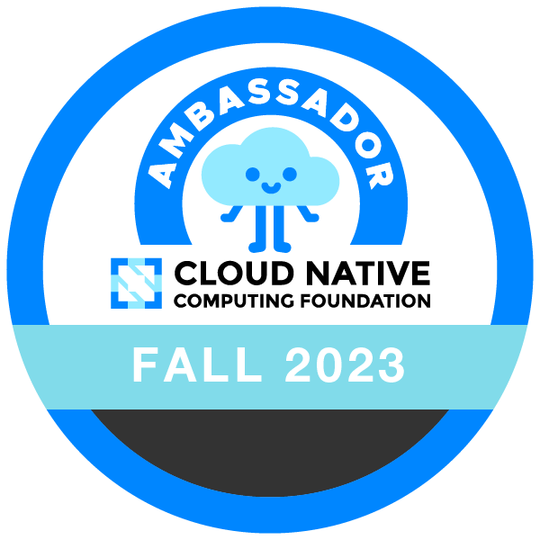

<!-- .slide: data-background="../img/viktor.jpg"  data-background-size="cover" -->
# Mauricio Salatino

<!-- .slide: data-background="../img/products/upbound.png" data-background-size="contain" -->

<!-- .slide: data-background="../img/products/twitter.png" data-background-size="contain" -->
# @salaboy

<!-- .slide: class="center" -->

 <!-- .element: class="fragment" -->

 <!-- .element: class="fragment" -->

diagrid.io

Platform Engineering on Kubernetes

salaboy.com
