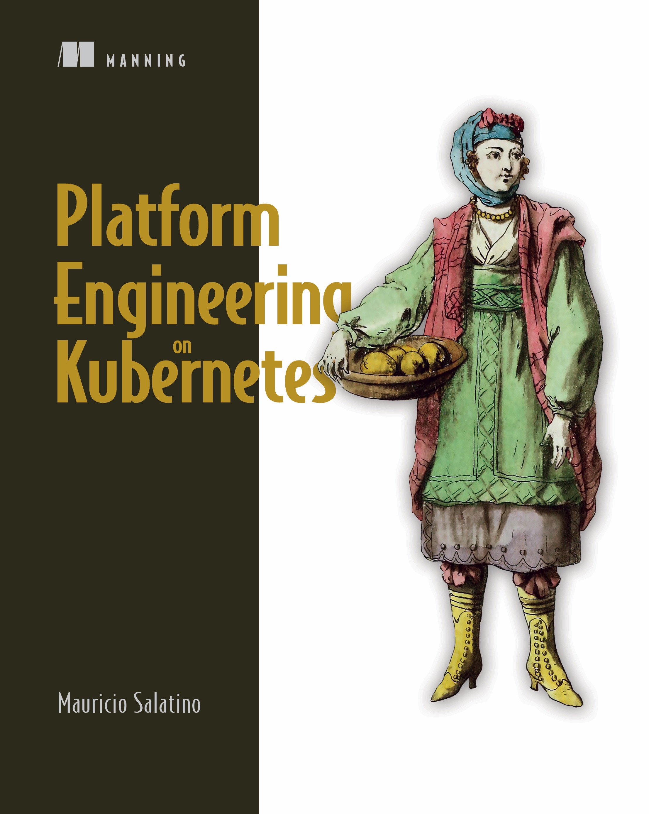

<!-- .slide: data-background="../docs/img/salaboy-bio.jpeg"  data-background-size="cover" -->
# Mauricio Salatino

<!-- .slide: data-background="../docs/img/salaboy-diagrid.png" data-background-size="contain" -->

<!-- .slide: data-background="../img/products/twitter.png" data-background-size="contain" -->
# @salaboy

### Platform Engineering on Kubernetes

<figure style="width: 60%; height: 60%; margin-left:100px;float: left;">
    

 
</figure>

<figure style="width: 60%; height: 360%; margin-right:100px;float: right;">
    
</figure>

