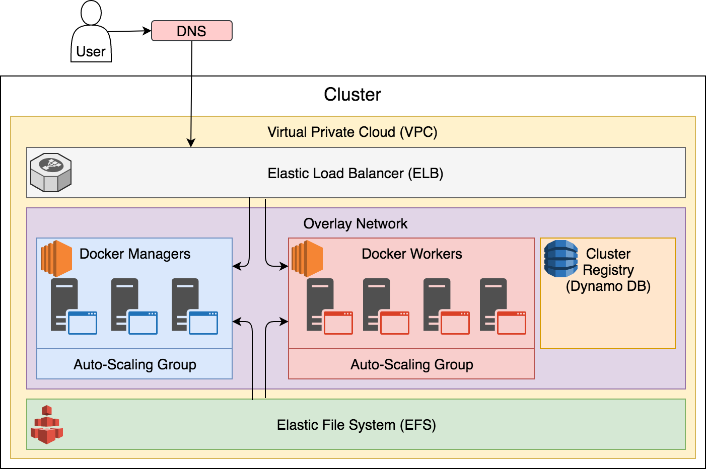

<!-- .slide: data-background="../img/background/servers.jpg" -->
## Hands-On Time

---

# Immutable

# infrastructure

# as code


# Docker for AWS

---

[youtu.be/r5cofUYqnn8](https://youtu.be/r5cofUYqnn8)


## Prerequisites

---

* [Git](https://git-scm.com/)
* [AWS account](https://aws.amazon.com/)
* [AWS CLI](https://aws.amazon.com/cli/)
* [jq](https://stedolan.github.io/jq/)
* GitBash (if Windows)


## Environment variables

---

```bash
export AWS_ACCESS_KEY_ID=[...]

export AWS_SECRET_ACCESS_KEY=[...]

export AWS_DEFAULT_REGION=us-east-2

aws ec2 create-key-pair --key-name workshop \
  | jq -r '.KeyMaterial' >workshop.pem

chmod 400 workshop.pem
```


## Creating A Cluster

---

```bash
aws cloudformation create-stack \
    --template-url https://editions-us-east-1.s3.amazonaws.com/aws/stable/Docker.tmpl \
    --capabilities CAPABILITY_IAM \
    --stack-name devops22 \
    --parameters \
    ParameterKey=ManagerSize,ParameterValue=3 \
    ParameterKey=ClusterSize,ParameterValue=0 \
    ParameterKey=KeyName,ParameterValue=workshop \
    ParameterKey=EnableSystemPrune,ParameterValue=yes \
    ParameterKey=EnableCloudWatchLogs,ParameterValue=no \
    ParameterKey=EnableCloudStorEfs,ParameterValue=yes \
    ParameterKey=ManagerInstanceType,ParameterValue=t2.small \
    ParameterKey=InstanceType,ParameterValue=t2.small
```





## Cluster Info

---

```bash
aws cloudformation describe-stacks --stack-name devops22 | \
  jq -r ".Stacks[0].StackStatus"

aws cloudformation describe-stack-resources \
    --stack-name devops22 | jq "."

CLUSTER_DNS=$(aws cloudformation describe-stacks \
  --stack-name devops22 | jq -r ".Stacks[0].Outputs[] | \
  select(.OutputKey==\"DefaultDNSTarget\").OutputValue")

CLUSTER_IP=$(aws ec2 describe-instances | jq -r ".Reservations[] \
  .Instances[] | select(.SecurityGroups[].GroupName | \
  contains(\"devops22-ManagerVpcSG\")).PublicIpAddress" | tail -n 1)

echo $CLUSTER_DNS && echo $CLUSTER_IP
```


## Visualizer

---

```bash
ssh -i workshop.pem docker@$CLUSTER_IP

echo "export CLUSTER_DNS=[...]
export CLUSTER_IP=[...]
export DOCKER_HUB_USER=[...]
">creds

docker node ls

curl -o visualizer.yml https://raw.githubusercontent.com/vfarcic/docker-flow-stacks/master/web/docker-visualizer.yml

HTTP_PORT=8083 docker stack deploy -c visualizer.yml visualizer

exit

open "http://$CLUSTER_DNS:8083"
```


## Docker Flow Proxy

---

```bash
ssh -i workshop.pem docker@$CLUSTER_IP

curl -o proxy.yml \
  https://raw.githubusercontent.com/vfarcic/docker-flow-stacks/master/proxy/docker-flow-proxy.yml

cat proxy.yml

docker network create -d overlay proxy

docker stack deploy -c proxy.yml proxy
```

## [proxy.dockerflow.com](http://proxy.dockerflow.com)
