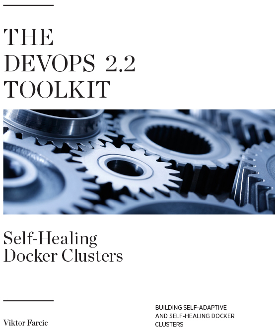

## [@vfarcic](https://twitter.com/vfarcic)

---

## [TechnologyConversations.com](http://technologyconversations.com)

---

## [The DevOps Toolkit Series](https://www.youtube.com/channel/UCfz8x0lVzJpb_dgWm9kPVrw)

---

 

## [Getting Started With Docker](https://www.packtpub.com/application-development/getting-started-docker-112-video)

---

 

<figure style="width: 12%; height: 12%; float: left;">
    
    <figcaption><a href="http://www.amazon.com/dp/B01BJ4V66M">Amazon</a></figcaption>
</figure>
<figure style="width: 12%; height: 12%; float: right;">
    
    <figcaption><a href="https://leanpub.com/the-devops-2-toolkit">LeanPub</a></figcaption>
</figure>

<figure style="width: 12%; height: 12%; float: left;">
    
    <figcaption><a href="https://www.amazon.com/dp/1542468914">Amazon</a></figcaption>
</figure>
<figure style="width: 12%; height: 12%; float: right;">
    
    <figcaption><a href="https://leanpub.com/the-devops-2-1-toolkit">LeanPub</a></figcaption>
</figure>

<figure style="width: 12%; height: 12%; float: left;">
    Amazon:
     coming soon
</figure>
<figure style="width: 12%; height: 12%; float: right;">
    
    <figcaption><a href="https://leanpub.com/the-devops-2-2-toolkit">LeanPub</a></figcaption>
</figure>

