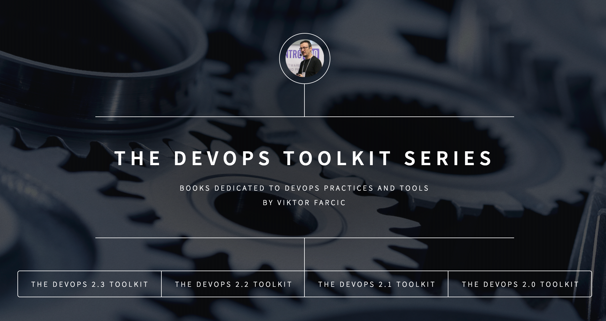

<!-- .slide: data-background="../img/products/twitter.png" data-background-size="contain" -->
# [@vfarcic](https://twitter.com/vfarcic)

## [TechnologyConversations.com](http://technologyconversations.com)

---

## Courses

---

## [Getting Started With Docker](https://www.packtpub.com/application-development/getting-started-docker-video)

 

## Videos (YouTube)

---

## [The DevOps Toolkit Series](https://www.youtube.com/channel/UCfz8x0lVzJpb_dgWm9kPVrw)

 

## Books

---

## [DevOpsToolkitSeries.com](http://www.devopstoolkitseries.com/)

<figure style="width: 50%; height: 50%; float: left;">
    
    <h3>[@vfarcic](https://twitter.com/vfarcic)</h3>
    <h3>viktor@farcic.com</h3>
</figure>
<figure style="width: 50%; height: 50%; float: right;">
    
</figure>
