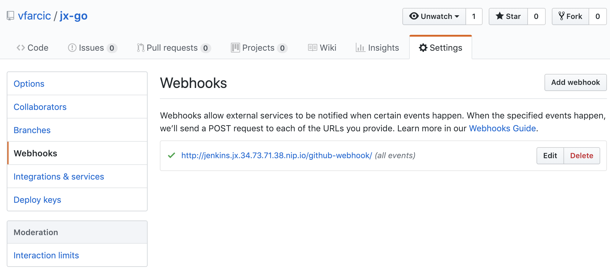
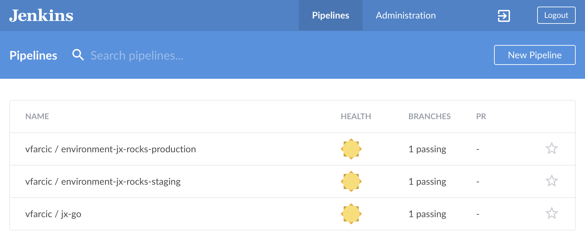

```bash
jx create quickstart # Cancel with ctrl+c
```

```
? select the quickstart you wish to create  [Use arrows to move, type to filter]
  android-quickstart
  angular-io-quickstart
  aspnet-app
  dlang-http
  golang-http
  jenkins-cwp-quickstart
  jenkins-quickstart
  node-http
  node-http-watch-pipeline-activity
  open-liberty
  python-http
  rails-shopping-cart
  react-quickstart
  rust-http
  scala-akka-http-quickstart
  spring-boot-http-gradle
  spring-boot-rest-prometheus
  spring-boot-watch-pipeline-activity
  vertx-rest-prometheus
```

```bash
jx create quickstart -l go -p jx-go -b true
```

```
Generated quickstart at /Users/vfarcic/code/k8s-specs/jx-go
### NO charts folder /Users/vfarcic/code/k8s-specs/jx-go/charts/golang-http
Created project at /Users/vfarcic/code/k8s-specs/jx-go

No username defined for the current Git server!

Git repository created
performing pack detection in folder /Users/vfarcic/code/k8s-specs/jx-go
--> Draft detected Go (65.746753%)
selected pack: /Users/vfarcic/.jx/draft/packs/github.com/jenkins-x-buildpacks/jenkins-x-kubernetes/packs/go
replacing placeholders in directory /Users/vfarcic/code/k8s-specs/jx-go
app name: jx-go, git server: github.com, org: vfarcic, Docker registry org: vfarcic
skipping directory "/Users/vfarcic/code/k8s-specs/jx-go/.git"
Using Git provider GitHub at https://github.com


About to create repository jx-go on server https://github.com with user vfarcic


Creating repository vfarcic/jx-go
Pushed Git repository to https://github.com/vfarcic/jx-go

Created Jenkins Project: http://jenkins.jx.34.73.71.38.nip.io/job/vfarcic/job/jx-go/

Watch pipeline activity via:    jx get activity -f jx-go -w
Browse the pipeline log via:    jx get build logs vfarcic/jx-go/master
Open the Jenkins console via    jx console
You can list the pipelines via: jx get pipelines
When the pipeline is complete:  jx get applications

For more help on available commands see: https://jenkins-x.io/developing/browsing/

Note that your first pipeline may take a few minutes to start while the necessary images get downloaded!

Creating GitHub webhook for vfarcic/jx-go for url http://jenkins.jx.34.73.71.38.nip.io/github-webhook/
```

```bash
GH_USER=[...]

open "https://github.com/$GH_USER/jx-go"

ls -1 jx-go
```

```
Dockerfile
Jenkinsfile
Makefile
OWNERS
OWNERS_ALIASES
README.md
charts
curlloop.sh
main.go
skaffold.yaml
watch.sh
```

```bash
cat jx-go/Dockerfile
```

```
FROM scratch
EXPOSE 8080
ENTRYPOINT ["/jx-go"]
COPY ./bin/ /
```

```bash
cat jx-go/Jenkinsfile
```

```groovy
pipeline {
  agent {
    label "jenkins-go"
  }
  environment {
    ORG = 'vfarcic'
    APP_NAME = 'jx-go'
    CHARTMUSEUM_CREDS = credentials('jenkins-x-chartmuseum')
  }
  stages {
    stage('CI Build and push snapshot') {
      when {
        branch 'PR-*'
      }
      environment {
        PREVIEW_VERSION = "0.0.0-SNAPSHOT-$BRANCH_NAME-$BUILD_NUMBER"
        PREVIEW_NAMESPACE = "$APP_NAME-$BRANCH_NAME".toLowerCase()
        HELM_RELEASE = "$PREVIEW_NAMESPACE".toLowerCase()
      }
      steps {
        container('go') {
          dir('/home/jenkins/go/src/github.com/vfarcic/jx-go') {
            checkout scm
            sh "make linux"
            sh "export VERSION=$PREVIEW_VERSION && skaffold build -f skaffold.yaml"
            sh "jx step post build --image $DOCKER_REGISTRY/$ORG/$APP_NAME:$PREVIEW_VERSION"
          }
          dir('/home/jenkins/go/src/github.com/vfarcic/jx-go/charts/preview') {
            sh "make preview"
            sh "jx preview --app $APP_NAME --dir ../.."
          }
        }
      }
    }
    stage('Build Release') {
      when {
        branch 'master'
      }
      steps {
        container('go') {
          dir('/home/jenkins/go/src/github.com/vfarcic/jx-go') {
            checkout scm

            // ensure we're not on a detached head
            sh "git checkout master"
            sh "git config --global credential.helper store"
            sh "jx step git credentials"

            // so we can retrieve the version in later steps
            sh "echo \$(jx-release-version) > VERSION"
            sh "jx step tag --version \$(cat VERSION)"
            sh "make build"
            sh "export VERSION=`cat VERSION` && skaffold build -f skaffold.yaml"
            sh "jx step post build --image $DOCKER_REGISTRY/$ORG/$APP_NAME:\$(cat VERSION)"
          }
        }
      }
    }
    stage('Promote to Environments') {
      when {
        branch 'master'
      }
      steps {
        container('go') {
          dir('/home/jenkins/go/src/github.com/vfarcic/jx-go/charts/jx-go') {
            sh "jx step changelog --version v\$(cat ../../VERSION)"

            // release the helm chart
            sh "jx step helm release"

            // promote through all 'Auto' promotion Environments
            sh "jx promote -b --all-auto --timeout 1h --version \$(cat ../../VERSION)"
          }
        }
      }
    }
  }
}
```

```bash
cat jx-go/Makefile
```

```
SHELL := /bin/bash
GO := GO15VENDOREXPERIMENT=1 go
NAME := jx-go
OS := $(shell uname)
MAIN_GO := main.go
ROOT_PACKAGE := $(GIT_PROVIDER)/$(ORG)/$(NAME)
GO_VERSION := $(shell $(GO) version | sed -e 's/^[^0-9.]*\([0-9.]*\).*/\1/')
PACKAGE_DIRS := $(shell $(GO) list ./... | grep -v /vendor/)
PKGS := $(shell go list ./... | grep -v /vendor | grep -v generated)
PKGS := $(subst  :,_,$(PKGS))
BUILDFLAGS := ''
CGO_ENABLED = 0
VENDOR_DIR=vendor

all: build

check: fmt build test

build:
	CGO_ENABLED=$(CGO_ENABLED) $(GO) build -ldflags $(BUILDFLAGS) -o bin/$(NAME) $(MAIN_GO)

test: 
	CGO_ENABLED=$(CGO_ENABLED) $(GO) test $(PACKAGE_DIRS) -test.v

full: $(PKGS)

install:
	GOBIN=${GOPATH}/bin $(GO) install -ldflags $(BUILDFLAGS) $(MAIN_GO)

fmt:
	@FORMATTED=`$(GO) fmt $(PACKAGE_DIRS)`
	@([[ ! -z "$(FORMATTED)" ]] && printf "Fixed unformatted files:\n$(FORMATTED)") || true

clean:
	rm -rf build release

linux:
	CGO_ENABLED=$(CGO_ENABLED) GOOS=linux GOARCH=amd64 $(GO) build -ldflags $(BUILDFLAGS) -o bin/$(NAME) $(MAIN_GO)

.PHONY: release clean

FGT := $(GOPATH)/bin/fgt
$(FGT):
	go get github.com/GeertJohan/fgt

GOLINT := $(GOPATH)/bin/golint
$(GOLINT):
	go get github.com/golang/lint/golint

$(PKGS): $(GOLINT) $(FGT)
	@echo "LINTING"
	@$(FGT) $(GOLINT) $(GOPATH)/src/$@/*.go
	@echo "VETTING"
	@go vet -v $@
	@echo "TESTING"
	@go test -v $@

.PHONY: lint
lint: vendor | $(PKGS) $(GOLINT) # ❷
	@cd $(BASE) && ret=0 && for pkg in $(PKGS); do \
	    test -z "$$($(GOLINT) $$pkg | tee /dev/stderr)" || ret=1 ; \
	done ; exit $$ret

watch:
	reflex -r "\.go$" -R "vendor.*" make skaffold-run

skaffold-run: build
	skaffold run -p dev
```

```bash
cat jx-go/skaffold.yaml
```

```yaml
apiVersion: skaffold/v1alpha2
kind: Config
build:
  tagPolicy:
    envTemplate:
      template: "{{.DOCKER_REGISTRY}}/vfarcic/jx-go:{{.VERSION}}"
  artifacts:
  - imageName: changeme
    workspace: .
    docker: {}
  local: {}
deploy:
  kubectl:
    manifests:
profiles:
- name: dev
  build:
    tagPolicy:
      envTemplate:
        template: "{{.DOCKER_REGISTRY}}/vfarcic/jx-go:{{.DIGEST_HEX}}"
    artifacts:
    - docker: {}
    local: {}
  deploy:
    helm:
      releases:
      - name: jx-go
        chartPath: charts/jx-go
        setValueTemplates:
          image.repository: "{{.DOCKER_REGISTRY}}/vfarcic/jx-go"
          image.tag: "{{.DIGEST_HEX}}"
```

```bash
ls -1 jx-go/charts
```

```
jx-go
preview
```

```bash
ls -1 jx-go/charts/jx-go
```

```
Chart.yaml
Makefile
README.md
charts
templates
values.yaml
```

```bash
ls -1 jx-go/charts/preview
```

```
Chart.yaml
Makefile
charts
requirements.yaml
templates
values.yaml
```

```bash
open "https://github.com/$GH_USER/jx-go/settings/hooks"
```



```bash
open "https://github.com/jenkins-x-quickstarts"

ls -1 ~/.jx/draft/packs/github.com/jenkins-x/draft-packs/packs
```

```
D
README.md
appserver
csharp
dropwizard
go
gradle
javascript
liberty
maven
php
python
ruby
rust
scala
swift
```

```bash
kubectl get pods
```

```
NAME                                              READY   STATUS    RESTARTS   AGE
jenkins-857d8667c5-57kdt                          1/1     Running   0          23m
jenkins-x-chartmuseum-5b6f9fd646-7pp7b            1/1     Running   0          23m
jenkins-x-controllercommitstatus-55c6d57c-xxlvb   1/1     Running   0          23m
jenkins-x-controllerrole-548f6bb76b-rzkrv         1/1     Running   0          23m
jenkins-x-controllerteam-7b867bd474-fgstw         1/1     Running   0          23m
jenkins-x-controllerworkflow-55f4f856c-d9lt5      1/1     Running   0          23m
jenkins-x-docker-registry-fb7878f76-74fkn         1/1     Running   0          23m
jenkins-x-heapster-c6d44bc95-lwn54                2/2     Running   0          23m
jenkins-x-mongodb-7dd488d47b-5vfwd                1/1     Running   1          23m
jenkins-x-monocular-api-7c7564c95b-sqmpm          1/1     Running   3          23m
jenkins-x-monocular-prerender-64f989797b-dvppw    1/1     Running   0          23m
jenkins-x-monocular-ui-6947596557-cs99n           1/1     Running   0          23m
jenkins-x-nexus-688df8c75f-fjc94                  1/1     Running   0          23m
```

```bash
jx console
```



```bash
jx get activities
```

```
STEP                                              STARTED AGO DURATION STATUS
vfarcic/environment-jx-rocks-production/master #1       21m7s    3m44s Succeeded 
  Checkout Source                                      18m16s       6s Succeeded 
  Validate Environment                                 18m10s      19s Succeeded 
  Update Environment                                   17m51s      27s Succeeded 
vfarcic/environment-jx-rocks-staging/master #1         21m16s    2m41s Succeeded 
  Checkout Source                                      19m31s       7s Succeeded 
  Validate Environment                                 19m24s      21s Succeeded 
  Update Environment                                    19m3s      28s Succeeded 
vfarcic/environment-jx-rocks-staging/master #2          9m27s    1m11s Succeeded 
  Checkout Source                                        9m6s       5s Succeeded 
  Validate Environment                                   9m1s      19s Succeeded 
  Update Environment                                    8m42s      26s Succeeded 
vfarcic/environment-jx-rocks-staging/PR-1 #1           10m33s      41s Succeeded 
  Checkout Source                                      10m15s       4s Succeeded 
  Validate Environment                                 10m11s      19s Succeeded 
  Update Environment                                    9m52s          NotExecuted 
vfarcic/jx-go/master #1                                 13m1s    4m50s Succeeded Version: 0.0.1
  Checkout Source                                      11m44s       4s Succeeded 
  CI Build and push snapshot                           11m40s          NotExecuted 
  Build Release                                        11m39s      42s Succeeded 
  Promote to Environments                              10m57s    2m45s Succeeded 
  Promote: staging                                     10m39s    2m26s Succeeded 
    PullRequest                                        10m39s    1m26s Succeeded  PullRequest: https://github.com/vfarcic/environment-jx-rocks-staging/pull/1 Merge SHA: dd3c0f331c83106b8ea86b79175b5d1d3f6a4e7d
    Update                                              9m13s     1m0s Succeeded  Status: Success at: http://jenkins.jx.34.73.71.38.nip.io/job/vfarcic/job/environment-jx-rocks-staging/job/master/2/display/redirect
    Promoted                                            9m13s     1m0s Succeeded  Application is at: http://jx-go.jx-staging.34.73.71.38.nip.io
```

```bash
jx get activities -f jx-go -w # Cancel with ctrl+c
```

```
STEP                         STARTED AGO DURATION STATUS
vfarcic/jx-go/master #1           13m29s    4m50s Succeeded Version: 0.0.1
  Checkout Source                 12m12s       4s Succeeded
  CI Build and push snapshot       12m8s          NotExecuted
  Build Release                    12m7s      42s Succeeded
  Promote to Environments         11m25s    2m45s Succeeded
  Promote: staging                 11m7s    2m26s Succeeded
    PullRequest                    11m7s    1m26s Succeeded  PullRequest: https://github.com/vfarcic/environment-jx-rocks-staging/pull/1 Merge SHA: dd3c0f331c83106b8ea86b79175b5d1d3f6a4e7d
    Update                         9m41s     1m0s Succeeded  Status: Success at: http://jenkins.jx.34.73.71.38.nip.io/job/vfarcic/job/environment-jx-rocks-staging/job/master/2/display/redirect
    Promoted                       9m41s     1m0s Succeeded  Application is at: http://jx-go.jx-staging.34.73.71.38.nip.io
```

```
URL=[...] # Copy Prometed

curl $URL
```

```
Hello from:  Jenkins X golang http example
```

```bash
jx get build logs # Cancel with ctrl+c
```

```
? Which pipeline do you want to view the logs of?:   [Use arrows to move, type to filter]
> vfarcic/environment-jx-rocks-production/master
  vfarcic/environment-jx-rocks-staging/master
  vfarcic/jx-go/master
```

```bash
jx get build logs -f jx-go
```

```
view the log at: http://jenkins.jx.34.73.71.38.nip.io/job/vfarcic/job/jx-go/job/master/1/console
tailing the log of vfarcic/jx-go/master #1
Branch indexing
Connecting to https://api.github.com using vfarcic/****** (API Token for acccessing https://github.com Git service inside pipelines)
Obtained Jenkinsfile from 74c8b582f15b7e6df852d5a0f0bdea782c830cbf
Running in Durability level: MAX_SURVIVABILITY
[Pipeline] node
Still waiting to schedule task
‘go-glc0t’ is offline
Agent go-glc0t is provisioned from template Kubernetes Pod Template
Agent specification [Kubernetes Pod Template] (jenkins-go): 
* [go] jenkinsxio/builder-go:0.1.185(resourceRequestCpu: 400m, resourceRequestMemory: 600Mi, resourceLimitCpu: 1, resourceLimitMemory: 1448Mi)
* [jnlp] jenkinsci/jnlp-slave:3.26-1-alpine(resourceRequestCpu: 100m, resourceRequestMemory: 128Mi)

Running on go-glc0t in /home/jenkins/workspace/vfarcic_jx-go_master
[Pipeline] {
[Pipeline] stage
[Pipeline] { (Declarative: Checkout SCM)
[Pipeline] checkout
Cloning the remote Git repository
Cloning with configured refspecs honoured and without tags
Fetching without tags
Checking out Revision 74c8b582f15b7e6df852d5a0f0bdea782c830cbf (master)
Cloning repository https://github.com/vfarcic/jx-go.git
 > git init /home/jenkins/workspace/vfarcic_jx-go_master # timeout=10
Fetching upstream changes from https://github.com/vfarcic/jx-go.git
 > git --version # timeout=10
using GIT_ASKPASS to set credentials API Token for acccessing https://github.com Git service inside pipelines
 > git fetch --no-tags --progress https://github.com/vfarcic/jx-go.git +refs/heads/master:refs/remotes/origin/master
 > git config remote.origin.url https://github.com/vfarcic/jx-go.git # timeout=10
 > git config --add remote.origin.fetch +refs/heads/master:refs/remotes/origin/master # timeout=10
 > git config remote.origin.url https://github.com/vfarcic/jx-go.git # timeout=10
Fetching upstream changes from https://github.com/vfarcic/jx-go.git
using GIT_ASKPASS to set credentials API Token for acccessing https://github.com Git service inside pipelines
 > git fetch --no-tags --progress https://github.com/vfarcic/jx-go.git +refs/heads/master:refs/remotes/origin/master
 > git config core.sparsecheckout # timeout=10
 > git checkout -f 74c8b582f15b7e6df852d5a0f0bdea782c830cbf
Commit message: "Draft create"
First time build. Skipping changelog.
[Pipeline] }
[Pipeline] // stage
[Pipeline] withEnv
[Pipeline] {
[Pipeline] withCredentials
[Pipeline] {
[Pipeline] withEnv
[Pipeline] {
[Pipeline] stage
[Pipeline] { (CI Build and push snapshot)
Stage "CI Build and push snapshot" skipped due to when conditional
[Pipeline] }
[Pipeline] // stage
[Pipeline] stage
[Pipeline] { (Build Release)
[Pipeline] container
[Pipeline] {
[Pipeline] dir
Running in /home/jenkins/go/src/github.com/vfarcic/jx-go
[Pipeline] {
[Pipeline] checkout
Cloning the remote Git repository
Cloning with configured refspecs honoured and without tags
Fetching without tags
Checking out Revision 74c8b582f15b7e6df852d5a0f0bdea782c830cbf (master)
Commit message: "Draft create"
[Pipeline] sh
Cloning repository https://github.com/vfarcic/jx-go.git
 > git init /home/jenkins/go/src/github.com/vfarcic/jx-go # timeout=10
Fetching upstream changes from https://github.com/vfarcic/jx-go.git
 > git --version # timeout=10
using GIT_ASKPASS to set credentials API Token for acccessing https://github.com Git service inside pipelines
 > git fetch --no-tags --progress https://github.com/vfarcic/jx-go.git +refs/heads/master:refs/remotes/origin/master
 > git config remote.origin.url https://github.com/vfarcic/jx-go.git # timeout=10
 > git config --add remote.origin.fetch +refs/heads/master:refs/remotes/origin/master # timeout=10
 > git config remote.origin.url https://github.com/vfarcic/jx-go.git # timeout=10
Fetching upstream changes from https://github.com/vfarcic/jx-go.git
using GIT_ASKPASS to set credentials API Token for acccessing https://github.com Git service inside pipelines
 > git fetch --no-tags --progress https://github.com/vfarcic/jx-go.git +refs/heads/master:refs/remotes/origin/master
 > git config core.sparsecheckout # timeout=10
 > git checkout -f 74c8b582f15b7e6df852d5a0f0bdea782c830cbf
+ git checkout master
Switched to a new branch 'master'
Branch master set up to track remote branch master from origin.
[Pipeline] sh
+ git config --global credential.helper store
[Pipeline] sh
+ jx step git credentials
Generated Git credentials file /home/jenkins/git/credentials
[Pipeline] sh
++ jx-release-version
+ echo 0.0.1
[Pipeline] sh
++ cat VERSION
+ jx step tag --version 0.0.1
Tag v0.0.1 created and pushed to remote origin
[Pipeline] sh
+ make build
CGO_ENABLED=0 GO15VENDOREXPERIMENT=1 go build -ldflags '' -o bin/jx-go main.go
[Pipeline] sh
++ cat VERSION
+ export VERSION=0.0.1
+ VERSION=0.0.1
+ skaffold build -f skaffold.yaml
time="2019-01-13T13:16:17Z" level=warning msg="config version (skaffold/v1alpha2) out of date: upgrading to latest (skaffold/v1beta2)"
Starting build...
Building [changeme]...
Sending build context to Docker daemon  525.8kB
Sending build context to Docker daemon  6.506MB

Step 1/4 : FROM scratch
 ---> 
Step 2/4 : EXPOSE 8080
 ---> Running in 51322dd6fbff
 ---> f28ce7940183
Step 3/4 : ENTRYPOINT /jx-go
 ---> Running in 4760b279dbde
 ---> e3e900367322
Step 4/4 : COPY ./bin/ /
 ---> 2953c7176081
Successfully built 2953c7176081
The push refers to a repository [10.31.246.91:5000/vfarcic/jx-go]
023ffd4a7efe: Preparing
023ffd4a7efe: Pushed
0.0.1: digest: sha256:43b6eddc788802ec09586e3f974267a90d67b6e9c6cebacbcba5a5823db82155 size: 528
Build complete in 1.484999935s
Starting test...
Test complete in 5.061µs
changeme -> 10.31.246.91:5000/vfarcic/jx-go:0.0.1
[Pipeline] sh
++ cat VERSION
+ jx step post build --image 10.31.246.91:5000/vfarcic/jx-go:0.0.1
[Pipeline] }
[Pipeline] // dir
[Pipeline] }
[Pipeline] // container
[Pipeline] }
[Pipeline] // stage
[Pipeline] stage
[Pipeline] { (Promote to Environments)
[Pipeline] container
[Pipeline] {
[Pipeline] dir
Running in /home/jenkins/go/src/github.com/vfarcic/jx-go/charts/jx-go
[Pipeline] {
[Pipeline] sh
++ cat ../../VERSION
+ jx step changelog --version v0.0.1
Using batch mode as inside a pipeline
Generating change log from git ref 74c8b582f15b7e6df852d5a0f0bdea782c830cbf => 06b7056f60385aae541125f301989181c6ed5ccb
Unable to find user: jenkins-x.googlegroups.com -- users.jenkins.io "jenkins-x.googlegroups.com" not found
Unable to find user: jenkins-x.googlegroups.com -- users.jenkins.io "jenkins-x.googlegroups.com" not found
Finding issues in commit messages using git format
No release found for vfarcic/jx-go and tag v0.0.1 so creating a new release
Updated the release information at https://github.com/vfarcic/jx-go/releases/tag/v0.0.1
generated: /home/jenkins/go/src/github.com/vfarcic/jx-go/charts/jx-go/templates/release.yaml
Created Release jx-go-0-0-1 resource in namespace jx
Updating PipelineActivity vfarcic-jx-go-master-1 with version 0.0.1
Updated PipelineActivities vfarcic-jx-go-master-1 with release notes URL: https://github.com/vfarcic/jx-go/releases/tag/v0.0.1
[Pipeline] sh
+ jx step helm release
No $CHART_REPOSITORY defined so using the default value of: http://jenkins-x-chartmuseum:8080
Adding missing Helm repo: jenkins-x http://chartmuseum.jenkins-x.io
Successfully added Helm repository jenkins-x.
Adding missing Helm repo: releases http://jenkins-x-chartmuseum:8080
Successfully added Helm repository releases.
No $CHART_REPOSITORY defined so using the default value of: http://jenkins-x-chartmuseum:8080
Uploading chart file jx-go-0.0.1.tgz to http://jenkins-x-chartmuseum:8080/api/charts
Received 201 response: {"saved":true}
[Pipeline] sh
++ cat ../../VERSION
+ jx promote -b --all-auto --timeout 1h --version 0.0.1
Promoting app jx-go version 0.0.1 to namespace jx-staging
Created Pull Request: https://github.com/vfarcic/environment-jx-rocks-staging/pull/1

Failed to query the Pull Request last commit status for https://github.com/vfarcic/environment-jx-rocks-staging/pull/1 ref 6362641b0d3ae85c8d874597ed7c0cc3c3a7cafe Could not find a status for repository vfarcic/environment-jx-rocks-staging with ref 6362641b0d3ae85c8d874597ed7c0cc3c3a7cafe
Failed to query the Pull Request last commit status for https://github.com/vfarcic/environment-jx-rocks-staging/pull/1 ref 6362641b0d3ae85c8d874597ed7c0cc3c3a7cafe Could not find a status for repository vfarcic/environment-jx-rocks-staging with ref 6362641b0d3ae85c8d874597ed7c0cc3c3a7cafe
Pull Request https://github.com/vfarcic/environment-jx-rocks-staging/pull/1 is merged at sha dd3c0f331c83106b8ea86b79175b5d1d3f6a4e7d
Merge commit has not yet any statuses on repo vfarcic/environment-jx-rocks-staging merge sha dd3c0f331c83106b8ea86b79175b5d1d3f6a4e7d
merge status: pending for URL https://api.github.com/repos/vfarcic/environment-jx-rocks-staging/statuses/dd3c0f331c83106b8ea86b79175b5d1d3f6a4e7d with target: http://jenkins.jx.34.73.71.38.nip.io/job/vfarcic/job/environment-jx-rocks-staging/job/master/2/display/redirect description: This commit is being built
merge status: success for URL https://api.github.com/repos/vfarcic/environment-jx-rocks-staging/statuses/dd3c0f331c83106b8ea86b79175b5d1d3f6a4e7d with target: http://jenkins.jx.34.73.71.38.nip.io/job/vfarcic/job/environment-jx-rocks-staging/job/master/2/display/redirect description: This commit looks good
Merge status checks all passed so the promotion worked!
[Pipeline] }
[Pipeline] // dir
[Pipeline] }
[Pipeline] // container
[Pipeline] }
[Pipeline] // stage
[Pipeline] }
[Pipeline] // withEnv
[Pipeline] }
[Pipeline] // withCredentials
[Pipeline] }
[Pipeline] // withEnv
[Pipeline] }
[Pipeline] // node
[Pipeline] End of Pipeline

GitHub has been notified of this commit’s build result

Finished: SUCCESS
```

```bash
jx get build logs $GH_USER/jx-go/master
```

```
view the log at: http://jenkins.jx.34.73.71.38.nip.io/job/vfarcic/job/jx-go/job/master/1/console
tailing the log of vfarcic/jx-go/master #1
Branch indexing
Connecting to https://api.github.com using vfarcic/****** (API Token for acccessing https://github.com Git service inside pipelines)
Obtained Jenkinsfile from 74c8b582f15b7e6df852d5a0f0bdea782c830cbf
Running in Durability level: MAX_SURVIVABILITY
[Pipeline] node
Still waiting to schedule task
‘go-glc0t’ is offline
Agent go-glc0t is provisioned from template Kubernetes Pod Template
Agent specification [Kubernetes Pod Template] (jenkins-go): 
* [go] jenkinsxio/builder-go:0.1.185(resourceRequestCpu: 400m, resourceRequestMemory: 600Mi, resourceLimitCpu: 1, resourceLimitMemory: 1448Mi)
* [jnlp] jenkinsci/jnlp-slave:3.26-1-alpine(resourceRequestCpu: 100m, resourceRequestMemory: 128Mi)

Running on go-glc0t in /home/jenkins/workspace/vfarcic_jx-go_master
[Pipeline] {
[Pipeline] stage
[Pipeline] { (Declarative: Checkout SCM)
[Pipeline] checkout
Cloning the remote Git repository
Cloning with configured refspecs honoured and without tags
Fetching without tags
Checking out Revision 74c8b582f15b7e6df852d5a0f0bdea782c830cbf (master)
Cloning repository https://github.com/vfarcic/jx-go.git
 > git init /home/jenkins/workspace/vfarcic_jx-go_master # timeout=10
Fetching upstream changes from https://github.com/vfarcic/jx-go.git
 > git --version # timeout=10
using GIT_ASKPASS to set credentials API Token for acccessing https://github.com Git service inside pipelines
 > git fetch --no-tags --progress https://github.com/vfarcic/jx-go.git +refs/heads/master:refs/remotes/origin/master
 > git config remote.origin.url https://github.com/vfarcic/jx-go.git # timeout=10
 > git config --add remote.origin.fetch +refs/heads/master:refs/remotes/origin/master # timeout=10
 > git config remote.origin.url https://github.com/vfarcic/jx-go.git # timeout=10
Fetching upstream changes from https://github.com/vfarcic/jx-go.git
using GIT_ASKPASS to set credentials API Token for acccessing https://github.com Git service inside pipelines
 > git fetch --no-tags --progress https://github.com/vfarcic/jx-go.git +refs/heads/master:refs/remotes/origin/master
 > git config core.sparsecheckout # timeout=10
 > git checkout -f 74c8b582f15b7e6df852d5a0f0bdea782c830cbf
Commit message: "Draft create"
First time build. Skipping changelog.
[Pipeline] }
[Pipeline] // stage
[Pipeline] withEnv
[Pipeline] {
[Pipeline] withCredentials
[Pipeline] {
[Pipeline] withEnv
[Pipeline] {
[Pipeline] stage
[Pipeline] { (CI Build and push snapshot)
Stage "CI Build and push snapshot" skipped due to when conditional
[Pipeline] }
[Pipeline] // stage
[Pipeline] stage
[Pipeline] { (Build Release)
[Pipeline] container
[Pipeline] {
[Pipeline] dir
Running in /home/jenkins/go/src/github.com/vfarcic/jx-go
[Pipeline] {
[Pipeline] checkout
Cloning the remote Git repository
Cloning with configured refspecs honoured and without tags
Fetching without tags
Checking out Revision 74c8b582f15b7e6df852d5a0f0bdea782c830cbf (master)
Commit message: "Draft create"
[Pipeline] sh
Cloning repository https://github.com/vfarcic/jx-go.git
 > git init /home/jenkins/go/src/github.com/vfarcic/jx-go # timeout=10
Fetching upstream changes from https://github.com/vfarcic/jx-go.git
 > git --version # timeout=10
using GIT_ASKPASS to set credentials API Token for acccessing https://github.com Git service inside pipelines
 > git fetch --no-tags --progress https://github.com/vfarcic/jx-go.git +refs/heads/master:refs/remotes/origin/master
 > git config remote.origin.url https://github.com/vfarcic/jx-go.git # timeout=10
 > git config --add remote.origin.fetch +refs/heads/master:refs/remotes/origin/master # timeout=10
 > git config remote.origin.url https://github.com/vfarcic/jx-go.git # timeout=10
Fetching upstream changes from https://github.com/vfarcic/jx-go.git
using GIT_ASKPASS to set credentials API Token for acccessing https://github.com Git service inside pipelines
 > git fetch --no-tags --progress https://github.com/vfarcic/jx-go.git +refs/heads/master:refs/remotes/origin/master
 > git config core.sparsecheckout # timeout=10
 > git checkout -f 74c8b582f15b7e6df852d5a0f0bdea782c830cbf
+ git checkout master
Switched to a new branch 'master'
Branch master set up to track remote branch master from origin.
[Pipeline] sh
+ git config --global credential.helper store
[Pipeline] sh
+ jx step git credentials
Generated Git credentials file /home/jenkins/git/credentials
[Pipeline] sh
++ jx-release-version
+ echo 0.0.1
[Pipeline] sh
++ cat VERSION
+ jx step tag --version 0.0.1
Tag v0.0.1 created and pushed to remote origin
[Pipeline] sh
+ make build
CGO_ENABLED=0 GO15VENDOREXPERIMENT=1 go build -ldflags '' -o bin/jx-go main.go
[Pipeline] sh
++ cat VERSION
+ export VERSION=0.0.1
+ VERSION=0.0.1
+ skaffold build -f skaffold.yaml
time="2019-01-13T13:16:17Z" level=warning msg="config version (skaffold/v1alpha2) out of date: upgrading to latest (skaffold/v1beta2)"
Starting build...
Building [changeme]...
Sending build context to Docker daemon  525.8kB
Sending build context to Docker daemon  6.506MB

Step 1/4 : FROM scratch
 ---> 
Step 2/4 : EXPOSE 8080
 ---> Running in 51322dd6fbff
 ---> f28ce7940183
Step 3/4 : ENTRYPOINT /jx-go
 ---> Running in 4760b279dbde
 ---> e3e900367322
Step 4/4 : COPY ./bin/ /
 ---> 2953c7176081
Successfully built 2953c7176081
The push refers to a repository [10.31.246.91:5000/vfarcic/jx-go]
023ffd4a7efe: Preparing
023ffd4a7efe: Pushed
0.0.1: digest: sha256:43b6eddc788802ec09586e3f974267a90d67b6e9c6cebacbcba5a5823db82155 size: 528
Build complete in 1.484999935s
Starting test...
Test complete in 5.061µs
changeme -> 10.31.246.91:5000/vfarcic/jx-go:0.0.1
[Pipeline] sh
++ cat VERSION
+ jx step post build --image 10.31.246.91:5000/vfarcic/jx-go:0.0.1
[Pipeline] }
[Pipeline] // dir
[Pipeline] }
[Pipeline] // container
[Pipeline] }
[Pipeline] // stage
[Pipeline] stage
[Pipeline] { (Promote to Environments)
[Pipeline] container
[Pipeline] {
[Pipeline] dir
Running in /home/jenkins/go/src/github.com/vfarcic/jx-go/charts/jx-go
[Pipeline] {
[Pipeline] sh
++ cat ../../VERSION
+ jx step changelog --version v0.0.1
Using batch mode as inside a pipeline
Generating change log from git ref 74c8b582f15b7e6df852d5a0f0bdea782c830cbf => 06b7056f60385aae541125f301989181c6ed5ccb
Unable to find user: jenkins-x.googlegroups.com -- users.jenkins.io "jenkins-x.googlegroups.com" not found
Unable to find user: jenkins-x.googlegroups.com -- users.jenkins.io "jenkins-x.googlegroups.com" not found
Finding issues in commit messages using git format
No release found for vfarcic/jx-go and tag v0.0.1 so creating a new release
Updated the release information at https://github.com/vfarcic/jx-go/releases/tag/v0.0.1
generated: /home/jenkins/go/src/github.com/vfarcic/jx-go/charts/jx-go/templates/release.yaml
Created Release jx-go-0-0-1 resource in namespace jx
Updating PipelineActivity vfarcic-jx-go-master-1 with version 0.0.1
Updated PipelineActivities vfarcic-jx-go-master-1 with release notes URL: https://github.com/vfarcic/jx-go/releases/tag/v0.0.1
[Pipeline] sh
+ jx step helm release
No $CHART_REPOSITORY defined so using the default value of: http://jenkins-x-chartmuseum:8080
Adding missing Helm repo: jenkins-x http://chartmuseum.jenkins-x.io
Successfully added Helm repository jenkins-x.
Adding missing Helm repo: releases http://jenkins-x-chartmuseum:8080
Successfully added Helm repository releases.
No $CHART_REPOSITORY defined so using the default value of: http://jenkins-x-chartmuseum:8080
Uploading chart file jx-go-0.0.1.tgz to http://jenkins-x-chartmuseum:8080/api/charts
Received 201 response: {"saved":true}
[Pipeline] sh
++ cat ../../VERSION
+ jx promote -b --all-auto --timeout 1h --version 0.0.1
Promoting app jx-go version 0.0.1 to namespace jx-staging
Created Pull Request: https://github.com/vfarcic/environment-jx-rocks-staging/pull/1

Failed to query the Pull Request last commit status for https://github.com/vfarcic/environment-jx-rocks-staging/pull/1 ref 6362641b0d3ae85c8d874597ed7c0cc3c3a7cafe Could not find a status for repository vfarcic/environment-jx-rocks-staging with ref 6362641b0d3ae85c8d874597ed7c0cc3c3a7cafe
Failed to query the Pull Request last commit status for https://github.com/vfarcic/environment-jx-rocks-staging/pull/1 ref 6362641b0d3ae85c8d874597ed7c0cc3c3a7cafe Could not find a status for repository vfarcic/environment-jx-rocks-staging with ref 6362641b0d3ae85c8d874597ed7c0cc3c3a7cafe
Pull Request https://github.com/vfarcic/environment-jx-rocks-staging/pull/1 is merged at sha dd3c0f331c83106b8ea86b79175b5d1d3f6a4e7d
Merge commit has not yet any statuses on repo vfarcic/environment-jx-rocks-staging merge sha dd3c0f331c83106b8ea86b79175b5d1d3f6a4e7d
merge status: pending for URL https://api.github.com/repos/vfarcic/environment-jx-rocks-staging/statuses/dd3c0f331c83106b8ea86b79175b5d1d3f6a4e7d with target: http://jenkins.jx.34.73.71.38.nip.io/job/vfarcic/job/environment-jx-rocks-staging/job/master/2/display/redirect description: This commit is being built
merge status: success for URL https://api.github.com/repos/vfarcic/environment-jx-rocks-staging/statuses/dd3c0f331c83106b8ea86b79175b5d1d3f6a4e7d with target: http://jenkins.jx.34.73.71.38.nip.io/job/vfarcic/job/environment-jx-rocks-staging/job/master/2/display/redirect description: This commit looks good
Merge status checks all passed so the promotion worked!
[Pipeline] }
[Pipeline] // dir
[Pipeline] }
[Pipeline] // container
[Pipeline] }
[Pipeline] // stage
[Pipeline] }
[Pipeline] // withEnv
[Pipeline] }
[Pipeline] // withCredentials
[Pipeline] }
[Pipeline] // withEnv
[Pipeline] }
[Pipeline] // node
[Pipeline] End of Pipeline

GitHub has been notified of this commit’s build result

Finished: SUCCESS
```

```bash
jx get pipelines
```

```
Name                                           URL                                                                                              LAST_BUILD STATUS  DURATION
vfarcic/environment-jx-rocks-production/master http://jenkins.jx.34.73.71.38.nip.io/job/vfarcic/job/environment-jx-rocks-production/job/master/ #1         SUCCESS 223.122µs
vfarcic/environment-jx-rocks-staging/master    http://jenkins.jx.34.73.71.38.nip.io/job/vfarcic/job/environment-jx-rocks-staging/job/master/    #2         SUCCESS 70.966µs
vfarcic/jx-go/master                           http://jenkins.jx.34.73.71.38.nip.io/job/vfarcic/job/jx-go/job/master/                           #1         SUCCESS 289.123µs
```

```bash
jx get apps
```

```
APPLICATION STAGING PODS URL                                        PRODUCTION PODS URL
jx-go       0.0.1   1/1  http://jx-go.jx-staging.34.73.71.38.nip.io
```

```bash
jx get apps -e staging
```

```
APPLICATION STAGING PODS URL
jx-go       0.0.1   1/1  http://jx-go.jx-staging.34.73.71.38.nip.io
```

```bash
open "https://github.com/$GH_USER/jx-go/releases"
```
