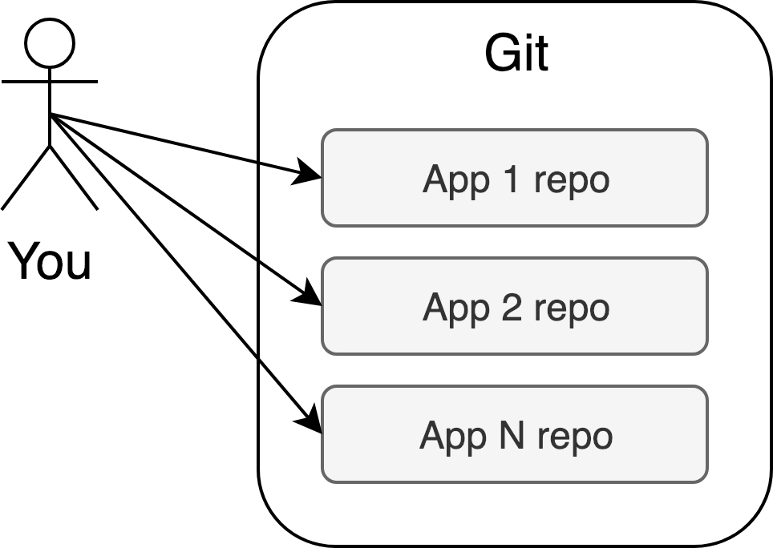
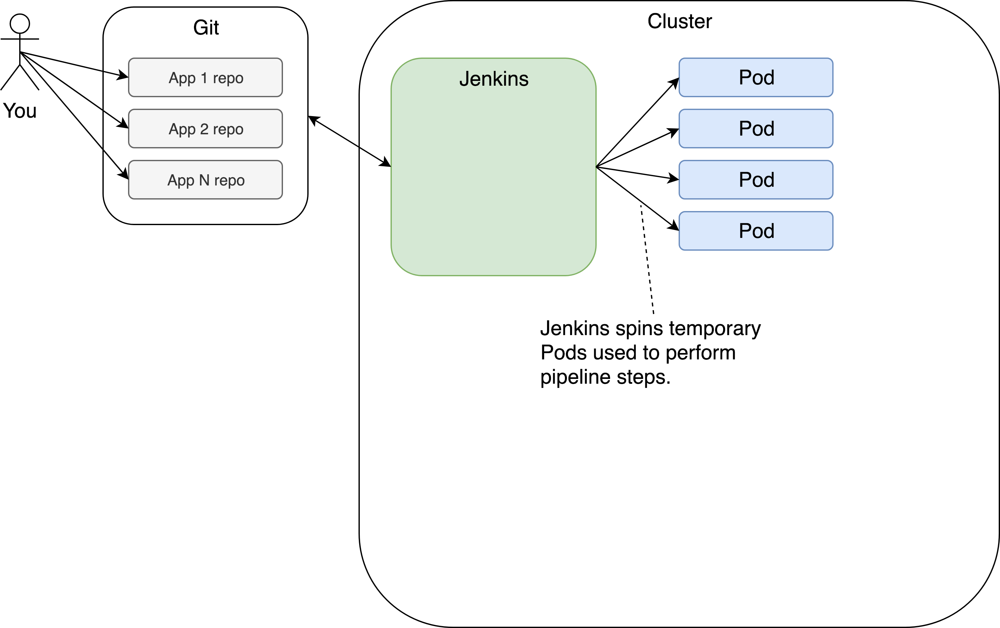
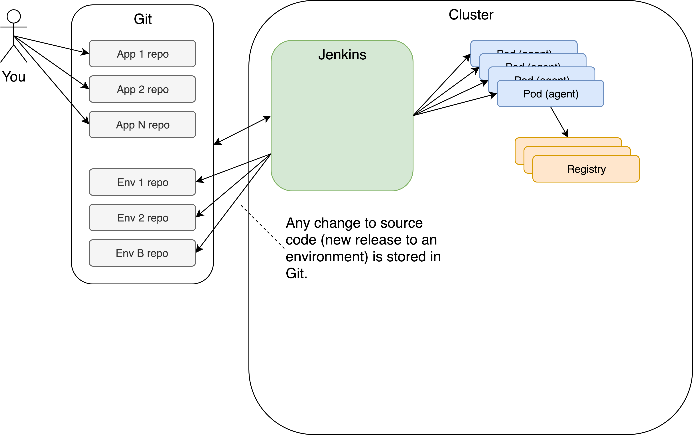

<!-- .slide: class="center dark" -->
<!-- .slide: data-background="../img/background/hands-on.jpg" -->
# Applying GitOps Principles

<div class="label">Hands-on Time</div>


<!-- .slide: class="dark" -->
<div class="eyebrow">Section 5</div>
<div class="label">Hands-on Time</div>

## Ten Commandments Of GitOps Applied To Continuous Delivery

### 1. Git is the only source of truth





<!-- .slide: class="dark" -->
<div class="eyebrow">Section 5</div>
<div class="label">Hands-on Time</div>

## Ten Commandments Of GitOps Applied To Continuous Delivery

### 2. Everything must be tracked, every action must be reproducible, and everything must be idempotent


<!-- .slide: class="dark" -->
<div class="eyebrow">Section 5</div>
<div class="label">Hands-on Time</div>

## Ten Commandments Of GitOps Applied To Continuous Delivery

### 3. Communication between processes must be asynchronous


<!-- .slide: class="dark" -->
<div class="eyebrow">Section 5</div>
<div class="label">Hands-on Time</div>

## Ten Commandments Of GitOps Applied To Continuous Delivery

### 4. Processes should run for as long as needed, but not longer





<!-- .slide: class="dark" -->
<div class="eyebrow">Section 5</div>
<div class="label">Hands-on Time</div>

## Ten Commandments Of GitOps Applied To Continuous Delivery

### 5. All binaries must be stored in registries


<!-- .slide: class="dark" -->
<div class="eyebrow">Section 5</div>
<div class="label">Hands-on Time</div>

## Ten Commandments Of GitOps Applied To Continuous Delivery

### 6. Information about all the releases must be stored in environment-specific repositories or branches


<!-- .slide: class="dark" -->
<div class="eyebrow">Section 5</div>
<div class="label">Hands-on Time</div>

## Ten Commandments Of GitOps Applied To Continuous Delivery

### 7. Everything must follow the same coding practices





<!-- .slide: class="dark" -->
<div class="eyebrow">Section 5</div>
<div class="label">Hands-on Time</div>

## Ten Commandments Of GitOps Applied To Continuous Delivery

### 8. All deployments must be idempotent


<!-- .slide: class="dark" -->
<div class="eyebrow">Section 5</div>
<div class="label">Hands-on Time</div>

## Ten Commandments Of GitOps Applied To Continuous Delivery

### 9. Git webhooks are the only ones allowed to initiate a change that will be applied to the system


<!-- .slide: class="dark" -->
<div class="eyebrow">Section 5</div>
<div class="label">Hands-on Time</div>

## Ten Commandments Of GitOps Applied To Continuous Delivery

### 10. All the tools must be able to speak with each other through APIs


<!-- .slide: class="dark" -->
<div class="eyebrow">Section 5</div>
<div class="label">Hands-on Time</div>

## In case you messed it up

```bash
git checkout buildpack-tekton && git merge -s ours master --no-edit

git checkout master && git merge buildpack-tekton

echo "buildPack: go" | tee jenkins-x.yml

git add . && git commit -m "Added jenkins-x.yml" && git push
```


<!-- .slide: class="dark" -->
<div class="eyebrow">Section 5</div>
<div class="label">Hands-on Time</div>

## Exploring Jenkins X Envs

```bash
jx get env

jx get env -p Auto

jx get env -p Manual

jx get env -p Never
```


<!-- .slide: class="dark" -->
<div class="eyebrow">Section 5</div>
<div class="label">Hands-on Time</div>

## Adapting The Staging Env

```bash
cd ..

git clone https://github.com/$GH_USER/environment-$CLUSTER_NAME-staging.git

cd environment-$CLUSTER_NAME-staging

ls -1
```


<!-- .slide: class="dark" -->
<div class="eyebrow">Section 5</div>
<div class="label">Hands-on Time</div>

## Adapting The Staging Env

```bash
cat Makefile

# Make sure that you use tabs instead of spaces
echo "test:
	ADDRESS=`kubectl -n $NAMESPACE-staging get ing go-demo-6 -o jsonpath=\"{.spec.rules[0].host}\"` go test -v" \
    | tee -a Makefile

curl -sSLo integration_test.go https://bit.ly/2Do5LRN

cat integration_test.go
```


<!-- .slide: class="dark" -->
<div class="eyebrow">Section 5</div>
<div class="label">Hands-on Time</div>

## Adapting The Staging Env

```bash
cat jenkins-x.yml

cat jenkins-x.yml |
sed -e \
    's@pipelines: {}@pipelines:\
    release:\
      postBuild:\
        steps:\
        - command: make test@g' | tee jenkins-x.yml

cat jenkins-x.yml
```


<!-- .slide: class="dark" -->
<div class="eyebrow">Section 5</div>
<div class="label">Hands-on Time</div>

## Adapting The Staging Env

```bash
ls -1 env

cat env/requirements.yaml
```


<!-- .slide: class="dark" -->
<div class="eyebrow">Section 5</div>
<div class="label">Hands-on Time</div>

## Adapting The Staging Env

```bash
git add .

git commit -m "Added tests"

git push

jx get activity --filter environment-$CLUSTER_NAME-staging/master --watch

jx get build logs

kubectl --namespace $NAMESPACE-staging get pods
```


<!-- .slide: class="dark" -->
<div class="eyebrow">Section 5</div>
<div class="label">Hands-on Time</div>

## App <> Env Pipelines

```bash
cat env/requirements.yaml
```


<!-- .slide: class="dark" -->
<div class="eyebrow">Section 5</div>
<div class="label">Hands-on Time</div>

## Controlling The Environments

<!-- https://github.com/jenkins-x/jx/issues/4795 -->
```bash
jx create env --name pre-production --label Pre-Production \
     --git-owner $GH_USER --namespace $NAMESPACE-pre-production \
     --promotion Manual --prefix $NAMESPACE --batch-mode

jx get env

jx delete env pre-production
```


<!-- .slide: class="dark" -->
<div class="eyebrow">Section 5</div>
<div class="label">Hands-on Time</div>

## Controlling The Environments

<!-- https://github.com/jenkins-x/jx/issues/4795 -->
```bash
hub delete -y $GH_USER/environment-$NAMESPACE-pre-production

rm -rf ~/.jx/environments/$GH_USER/environment-$NAMESPACE-pre-production

cd ..
```
