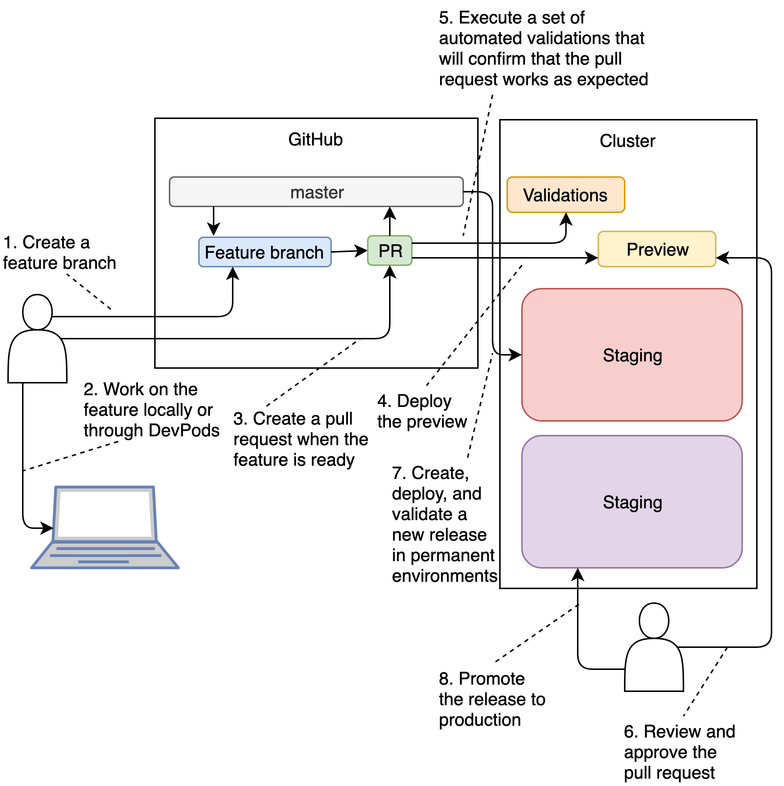

<!-- .slide: class="center dark" -->
<!-- .slide: data-background="img/hands-on.jpg" -->
# Working With Pull Requests And Preview Environments

<div class="label">Hands-on Time</div>


<!-- .slide: class="dark" -->
<div class="eyebrow">Section 6</div>
<div class="label">Hands-on Time</div>

## In case you messed it up

```bash
cd go-demo-6

git pull

git checkout dev && git merge -s ours master --no-edit

git checkout master && git merge dev

echo "buildPack: go" | tee jenkins-x.yml
```


<!-- .slide: class="dark" -->
<div class="eyebrow">Section 6</div>
<div class="label">Hands-on Time</div>

## In case you messed it up (GKE only)

```bash
cat charts/go-demo-6/Makefile | sed -e "s@vfarcic@$PROJECT@g" \
    | tee charts/go-demo-6/Makefile

cat charts/preview/Makefile | sed -e "s@vfarcic@$PROJECT@g" \
    | tee charts/preview/Makefile

cat skaffold.yaml | sed -e "s@vfarcic@$PROJECT@g" \
    | tee skaffold.yaml
```


<!-- .slide: class="dark" -->
<div class="eyebrow">Section 6</div>
<div class="label">Hands-on Time</div>

## In case you messed it up

```bash
git add . && git commit -m "Added jenkins-x.yml" && git push
```





<!-- .slide: class="dark" -->
<div class="eyebrow">Section 6</div>
<div class="label">Hands-on Time</div>

## Creating Pull Requests

```bash
git checkout -b my-new-pr

cat main.go | sed -e "s@hello, devpod with tests@hello, PR@g" \
    | tee main.go

cat main_test.go | sed -e "s@hello, devpod with tests@hello, PR@g" \
    | tee main_test.go
```


<!-- .slide: class="dark" -->
<div class="eyebrow">Section 6</div>
<div class="label">Hands-on Time</div>

## Creating Pull Requests

```bash
echo "

db:
  enabled: false

preview-db:
  persistence:
    enabled: false" | tee -a charts/preview/values.yaml
```


<!-- .slide: class="dark" -->
<div class="eyebrow">Section 6</div>
<div class="label">Hands-on Time</div>

## Creating Pull Requests

```bash
git add .

git commit -m "This is a PR"

git push --set-upstream origin my-new-pr

jx create pullrequest \
    --title "My PR" \
    --body "This is the text that describes the PR" \
    --batch-mode
```

* Open the link


<!-- .slide: class="dark" -->
<div class="eyebrow">Section 6</div>
<div class="label">Hands-on Time</div>

## Creating Pull Requests

```bash
jx get previews

PR_ADDR=[...]

curl "$PR_ADDR/demo/hello"
```


<!-- .slide: class="dark" -->
<div class="eyebrow">Section 6</div>
<div class="label">Hands-on Time</div>

## Merging A PR

* Open the pull request screen in GitHub
* Click *Merge pull request* button
* Click the *Confirm merge* button.

```bash
jx get activity --filter go-demo-6 --watch

jx get activity --filter environment-jx-rocks-staging --watch

jx get applications

STAGING_ADDR=[...] # Replace `[...]` with the URL

curl "$STAGING_ADDR/demo/hello"
```


<!-- .slide: class="dark" -->
<div class="eyebrow">Section 6</div>
<div class="label">Hands-on Time</div>

## jx Garbage Collection

```bash
kubectl get cronjobs

jx get previews

jx gc previews

jx get previews
```
