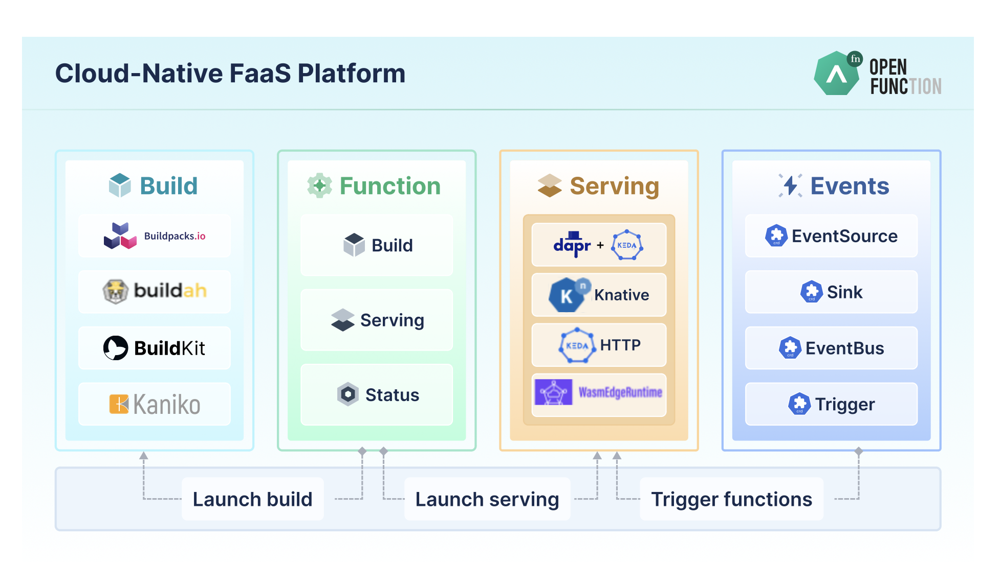

## What Do We Want?

## Serverless experience

* Here's source code, build it and run it
* Scale it up and down
* Don't ask me unnecessary questions
* Make it simple


### This experience is not available out-of-the-box in Kubernetes

* We need autoscalers
* We need a way to build from source to container
* We need to define the kind of Serverless experience we want
* We need a way to connect functions and infrastructure


## OpenFunction

* We looked at OpenFunctions 
* https://openfunction.dev

<a href="https://openfunction.dev"></a>

```sh
cat function.yaml
```


### Questions

* Does this experience work for you? 
* Are the projects used by OpenFunction glued in a way that works for your use case?
* What about application infrastructure that your functions will need? 


### Our findings 1/2

* Use OpenFunctions as an inspiration
* OpenFunctions is great but:
  * It is quite complex for someone who doesn't know all the tools
  * It is hard to debug when things go wrong


### Our findings 2/2

* Companies want to build their own experiences, for example:
  * Full control on your `functions` interfaces
  * Use GitHub actions to build containers and deploy to environments
  * Use ArgoCD to manage environments using GitOps


## What do you need to build your own experience? 1/3

* [Knative Serving](https://knative.dev/docs/concepts/)
  * From Container to URL
  * Check Knative Functions (CLI / Developer Experience)

<a href="https://knative.dev"></a>  


## What do you need to build your own experience? 1/3

```
apiVersion: serving.knative.dev/v1
kind: Service
metadata:
  name: my-service
spec:
  template:
    spec:
      containers:
      - image: <YOUR CONTAINER>
```


## What do you need to build your own experience? 2/3

* [Dapr](https://docs.dapr.io/concepts/overview/) 
  * APIs for developers to
    * Connect functions together
    * Connect to infrastructure and service that are available in the environment  

<a href="https://dapr.io"></a>


## What do you need to build your own experience? 2/3

<a href="https://dapr.io"></a>


## What do you need to build your own experience? 3/3

* [Crossplane](https://crossplane.io)
  * Provision and wire multi-cloud provider infrastructure
  * Wire components together so they can talk to each other

<a href="https://crossplane.io"></a>  

