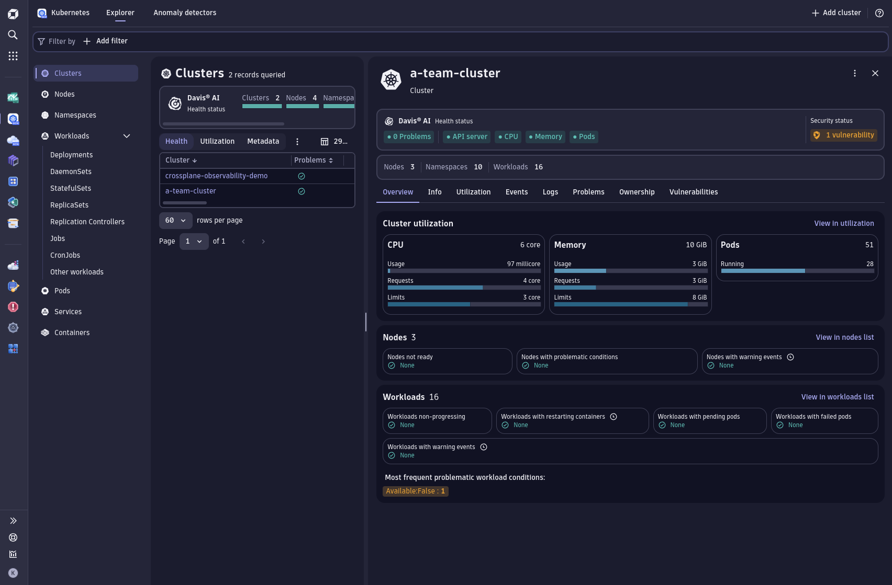
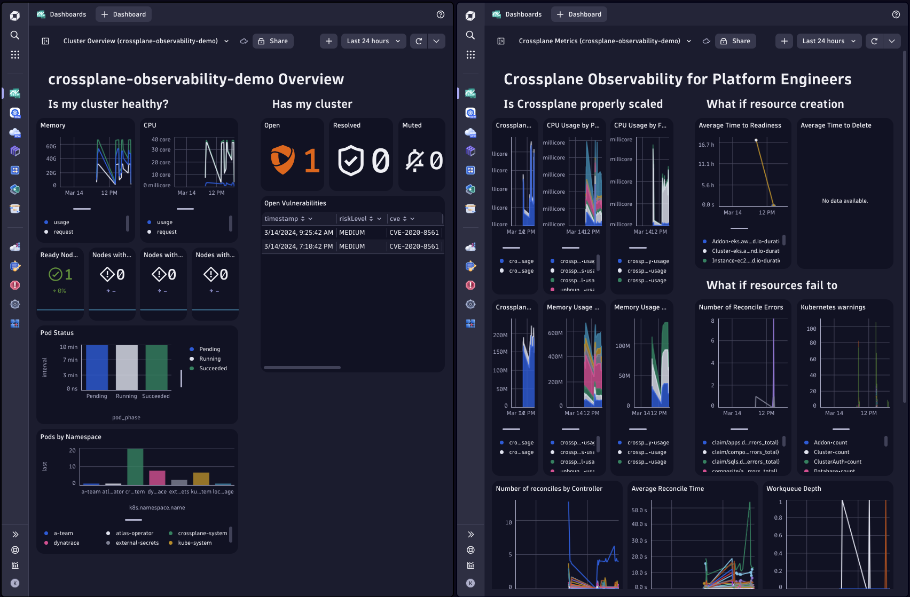
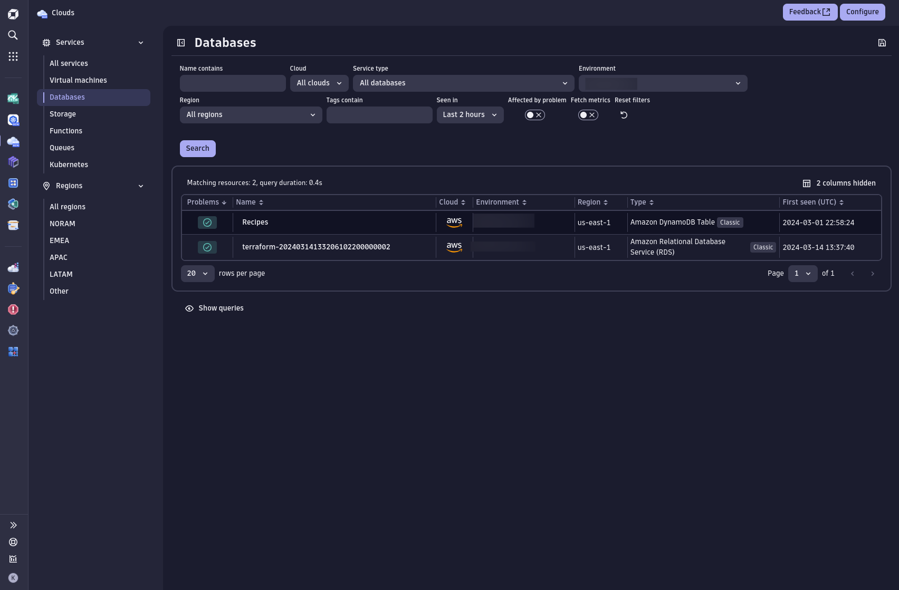
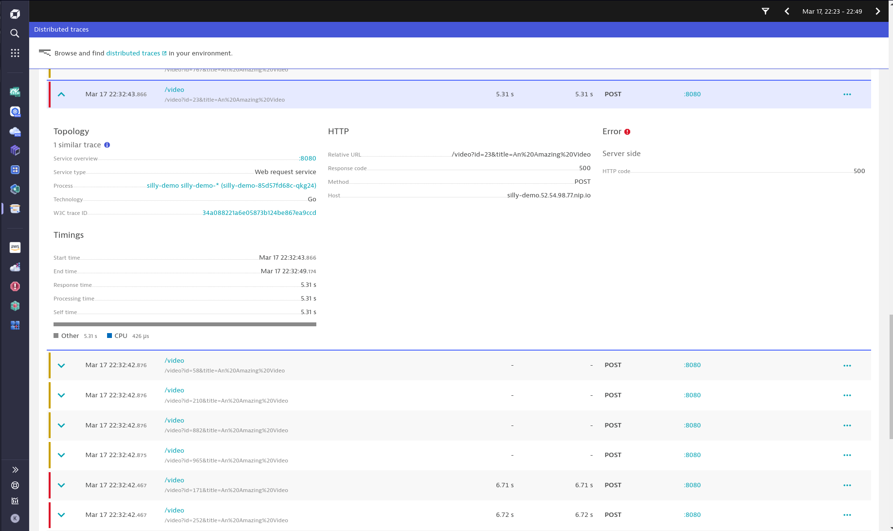
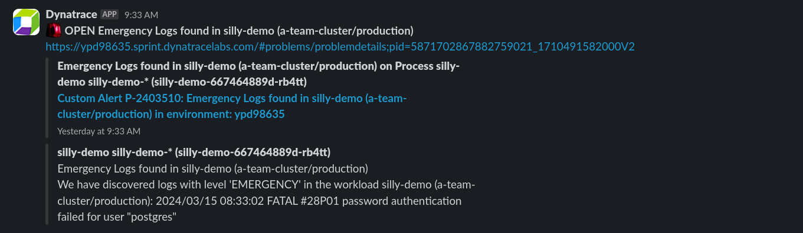

<!-- .slide: data-background="img/restaurant-blind-folds.png" -->


<!-- .slide: data-background="img/frustrated-dev.webp" -->


#### Dynatrace State of Observability Report

* Growing complexity
* Explosion of data
* Configuring monitoring detracts from innovation
* Few applications are fully instrumented

<div style="display: flex; flex-direction: column; align-items: center; gap: 8px; margin-top: 48px">
    
    <a style="font-size: small" href="https://www.dynatrace.com/info/reports/state-of-observability-2024/" target="_blank">State of Observability 2024</a>
</div>


#### Puppet State of DevOps Report

## Observability as a key goal of Platform Engineering

<div style="display: flex; flex-direction: column; align-items: center; gap: 8px; margin-top: 48px">
    
    <a style="font-size: small" href="https://www.puppet.com/resources/state-of-platform-engineering" target="_blank">State of DevOps 2023</a>
</div>


<!-- .slide: data-background="img/restaurant-observability.webp" -->


<!-- .slide: data-background="../img/background/hands-on.jpg" -->
## Hands-on Time

# Observability


## Crossplane CLI

```sh
cat cluster/aws.yaml
crossplane beta trace clusterclaim cluster --namespace a-team

cat db/aws.yaml
crossplane beta trace sqlclaim my-db --namespace a-team

cat app.yaml
crossplane beta trace appclaim silly-demo --namespace a-team
```


### Dynatrace Kubernetes App



### Cluster Dashboards



### Clouds App



## App Dashboard


## Generate load

https://app.ddosify.com


## App Traces



## Automatic problem notification

