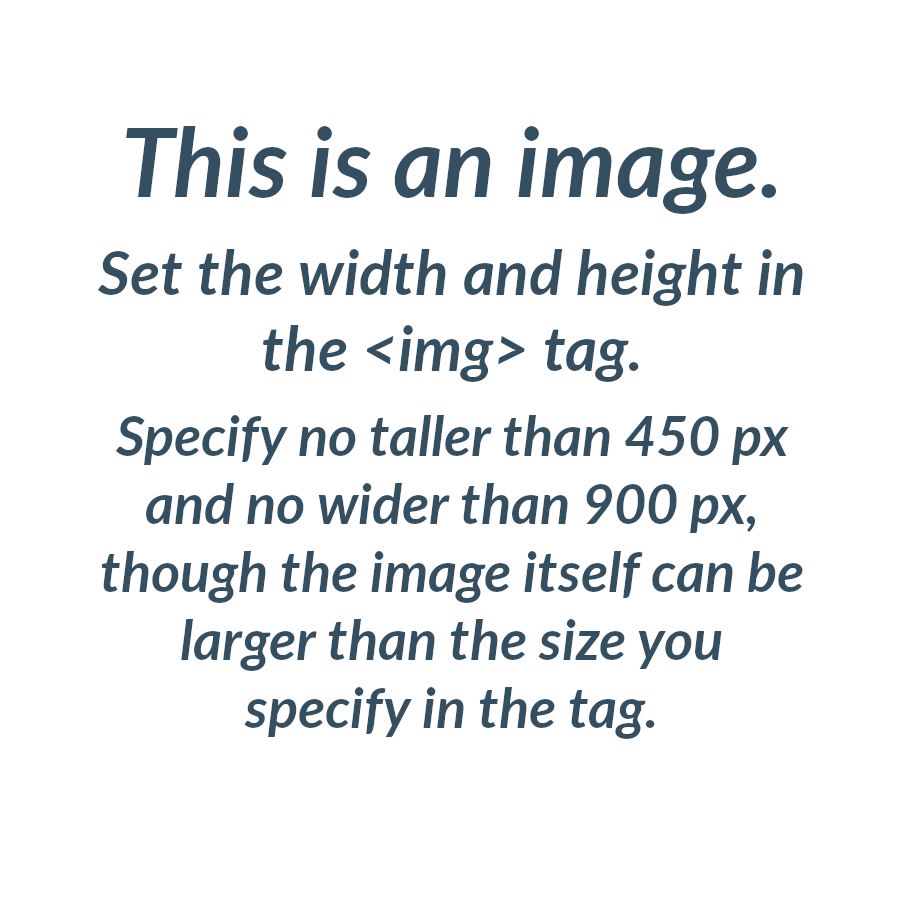

<!-- .slide: class="center" -->

Section 1 of 1

# Section Title

## Slide has a class of "center"

### Subsequent slide will have a class of "light"

#### Section has a linear gradient with brand colors over a background image

<!-- .slide: class="light" -->

Section 1 of 1

# Section Title (this is an h1)

> To get this layout &mdash; with different header sizes and content justified to the left, add a class of "light" to the slide (this is a blockquote).

> Tags like <strong>strong</strong> and <em>em</em> are supported.

<!-- .slide: class="light" -->

Section 1 of 1

# Section Title (this is an h1)

The "light" class also puts paragraph and list elements over a translucent white background (this is a p).

1. List item 1
2. List item 2

* Fragments are supported<!-- .element: class="fragment" -->

<!-- .slide: class="center" -->

<!-- .slide: class="center" -->
#### Display images as inline-block and use fragments to get fancy with it.

 <!-- .element: class="fragment" -->

 <!-- .element: class="fragment" -->

<!-- .slide: class="light" -->

Section 1 of 12

# What You'll Learn

> Topic in Hands-on section (this is a blockquote)

> Topic in Hands-on section

> Each overview should end with a list like this
